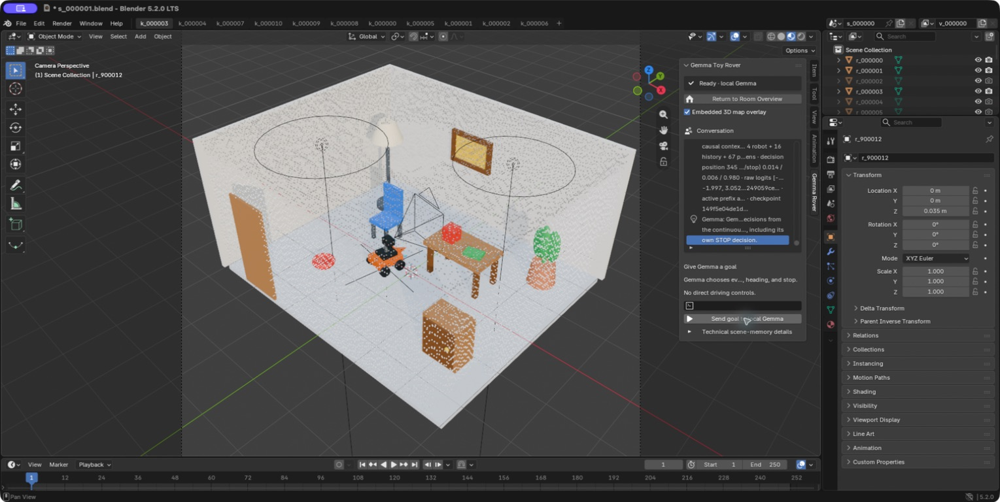

# Semantic 3D Chat — Current Proof-of-Concept Report

> Status snapshot: **working single-scene static-chat proof; model-only rover
> passed its bounded one-room live acceptance and is the practical-rover
> default**. This is not a held-out or project-wide final acceptance claim. The
> promoted strict V89 runtime
> is the static-chat default and scored
> 122/138 (88.41%) on its training-authorized scene-one canonical set; all 11 model
> gates and all 15 independent runtime gates passed. V75 is retained as a historical
> question-conditioned comparator: its one-candidate official validation reached
> 167/216 canonical but failed the spatial-relation gate. V66b completed its preregistered pair-disjoint training gate and failed; the checkpoint was correctly not published.
> Current schema-7 checkpoint state:
> `not_published`. V67 screen state: `authenticated_numeric_screen_failed_no_publication`. V68 grid state:
> `authenticated_all_arm_numeric_grid_failed_no_publication`. V69 grid state: `authenticated_all_arm_numeric_grid_failed_no_publication`. V70 screen state:
> `authenticated_numeric_screen_failed_no_publication`. V71 screen state: `authenticated_numeric_screen_failed_no_publication`. V72 state:
> `authenticated_terminal_development_negative_no_checkpoint`. V73--V77 state: `authenticated_v73_v74_rejected_v75_promoted_runtime_leakage_passed_official_validation_spatial_gate_failed_v76_rejected_v77_full_internal_screen_positive_not_promoted`.
> V79 relation-repair state: `authenticated_historical_scene_disjoint_screen_failed_no_promotion`.
> V80 atlas-attention-reader state: `authenticated_terminal_gradient_smoke_mps_oom_no_checkpoint_no_optimizer_update`.
> V81 sealed scene-memory state: `authenticated_experimental_runtime_historical_gate_failed_not_promoted`.
> V82 learned dense-reader state: `authenticated_historical_development_gate_failed_not_promoted`.
> V83 strict direct-memory state: `authenticated_strict_direct_behavior_failed_not_promoted`.
> V84/V84.1 immutable-memory bridge state:
> `authenticated_v84_nll_wiring_pass_v84_1_two_scene_causal_overfit_passed_not_promoted`.
> V85 scene-disjoint candidate state:
> `authenticated_development_gate_passed_runtime_packaging_equivalent_scene1_behavior_failed_not_promoted`.
> V86 strict single-scene terminal state:
> `authenticated_single_scene_overfit_model_gate_failed_86_of_138_not_promoted`.
> V87 balanced single-scene terminal state:
> `authenticated_balanced_single_scene_model_gates_failed_103_of_138_not_promoted`.
> V88 augmented development-known terminal state:
> `authenticated_augmented_single_scene_overall_gate_failed_107_of_138_not_promoted`.
> V89 retention-aware source/reporting state:
> `authenticated_runtime_ready_single_scene_122_of_138_promoted`.
> V94 terminal strong-causal diagnostic state:
> `terminal_measured_posthoc_diagnostic_non_promotable`.
> V95 strict causal successor state:
> `measured_preregistered_gate_not_passed` (gate failed; no promotion or deferred-final
> unlock; V89 remains default).
> V96 atomic-pair-repair successor state:
> `measured_preregistered_gate_not_passed` (174/216 known-development; 19/21 gates;
> prediction-change and invariant-stability gates failed; no promotion or
> deferred-final materialization; V89 remains default).
> Fixed-prefix attention-reader V6.3 state:
> `authenticated_positive_train_only_pilot_continuation_authorized_no_runtime_promotion`. V6.4 state:
> `authenticated_failed_pair_disjoint_generalization_no_checkpoint_no_promotion`. Demo package:
> `authenticated_minimal_two_file_v54_demo_release`. Historical motion/MCP integration:
> `live_semantic_mcp_and_embodied_conversation_scan_turn_refresh_passed_v75_controller_active`. Historical conversational MCP stdio:
> `passed_two_scene_live_official_mcp_stdio_integration`. Semantic conversational MCP face run:
> `authenticated_single_scene_selective_gemma_numeric_v3_official_mcp_face_passed`. Persistent five-turn MCP session:
> `authenticated_single_scene_five_turn_persistent_mcp_session_passed`. Historical hybrid semantic navigation:
> `passed_two_scene_hybrid_semantic_face_target_development`. Current model-only
> rover state: `dagger_v14_live_lap_face_approach_and_isolation_passed_one_scene_default`. V78 held point-cloud replay:
> `authenticated_historical_internal_held_pointcloud_reproduction_evaluation_only_not_promoted`. Approach V2:
> `authenticated_two_scene_v2_approach_development_one_of_two_passed`. Approach V3 successor:
> `authenticated_two_scene_v3_approach_development_two_of_two_passed`. V3 trajectory evidence:
> `authenticated_runtime_only_v3_approach_trajectory_visualization`. V3.3 development-calibration state:
> `accepted_development_calibration`. No V72, V6.3, or V6.4 checkpoint exists.
> V80 produced no checkpoint or optimizer update.
> V89's exact eleven-bank, two-file strict runtime is promoted as the current
> scene-one static-chat default. The rover has a separate 258-token,
> actual-local-Gemma model-only controller contract. Its runtime-aligned waypoint
> DAgger V14 checkpoint passed fresh lap, face-cube, approach-chair, and
> oracle-isolation checks and is the current practical-rover default. The older
> V3/hybrid and DAgger-v1 results are historical controls only. Held-out rover
> generalization and project-wide final acceptance are not claimed.

The current static-chat default is the promoted
strict V89 scene-one runtime at `data_gemma4/runtime/checkpoints/gemma4_v89_strict_scene1_release_v1` (checkpoint
fingerprint `9408092e589834671c79394260b67198262e4d2a4f1fe01f3f772fed6b4c2b1b`). `make demo`, `make chat`, and
the explicit `make v89-demo*` targets use this exact eleven-bank, two-file release.
V75 remains available only as the historical question-conditioned comparator;
V54 remains the legacy below-acceptance strict comparator.

V94's fixed-final 40-scene successor has a separately
authenticated **terminal post-hoc** seven-arm diagnostic over 216 questions from
six scenes. The primary arm scored 143/216
(66.20%), versus
85/216
(39.35%) with the complete scene
payload zeroed. That 26.85-point
drop and 138/216
changed outputs establish real aggregate scene dependence. The stricter binding
controls remain weak: paired wrong-scene memory fell only
1.39
points, while full interior-token permutation had no accuracy drop at all despite
changing 57
outputs. Voxel-level XYZ and 3,072D semantic shuffles reduced accuracy by
5.09
and 5.56
points. Removing RGB improved accuracy by
1.85 points,
so this run does not show useful incremental RGB dependence. Normals were already
all zero and viewpoint is not consumed, so neither was fabricated as an ablation.
The predictor was label-blind; a separate model-free scorer opened labels only
after prediction authentication and serialized no questions, answers, oracle, or
NLL. This diagnostic is not preregistered promotion evidence, did not pass V94's
behavior gate, and supports no release, held-out/generalization, official, or
final-acceptance claim. Evidence:
`reports/gemma4/metrics/v94_strong_causal_ablations.json`
(`37cbabc4333ce804572cceb1c64fff296923ce89a0d6fddaee652e019fbf0bf8`).

V95 then trained one preregistered strict causal
successor over all 40 training scenes. The fixed-final run consumed 960 rows in
each of four epochs, made 480 optimizer updates and 5,836 answer-NLL forwards,
and took 13234.8 s on MPS. Only a fresh
143,360-parameter unmerged bridge was trainable.
The exact `[1,738,1536]` continuous memory remained compiled before questions,
retained all 736 environmental payload tokens, and used no environmental text,
query-dependent retrieval, or question-conditioned scene processing.

The separately sealed, post-fixed-final **known-development** gate scored the
primary at 167/216
(77.31%), zero payload at
36/216, full interior-token permutation at
127/216, and paired wrong-scene
memory at 164/216. Control-minus-primary
mean answer-NLL gaps were +2.296439 for zero
payload, +0.616878 for permutation,
and +0.054092 for paired wrong scenes; the
changed-side paired-wrong gap was
+0.486824. Counterfactual behavior
remained below the locked gate: 13/24 correct
sides, 1/12 complete units, and
2/12 prediction-changing units.
The gate therefore **failed**. V95 was not promoted, deferred-final materialization
remains locked, and V89 remains the static-chat default runtime. This known-development
negative result is not held-out-final, official, generalization, or final-acceptance
evidence.

The aggregate evidence is hash bound: training
`2c7fc3ed47eaee1112c0fa2aadb412bb7b452087f6651957747dd07bfed59263`, structured score
`3477ebda24cc78e2722aa27e26e3841c5c1b4e316684e1a4ed68a9ffc4d04f84`, NLL score
`bc46a3e330a04f4b895929759e05ce33d07a9d7766f41943b415f496fce529c3`, final gate
`9d700e792cd353170ef636733874d1ac5b10d6bb5fdece09f2980298cfd00ef9`, and evidence seal
`e892516d60413ad24f06c56a0ce2d01410982548b32bcd3b8c340a04da44f346`. The bound config
is `9115c36b417d03bec935257b42e30597170d5acbf6c4683b5c021a8e4d9bbea2`, preregistration
`d60df9a9a04843fefbb46e8f2845613e5d887dc4f06665fe015c0aafcc7cf03d`, CPU preflight
`5ac211be59df4083588a776f4eb7d5a1b8ea38c9d635284b6452e45a5cb549ad`, candidate state
`53404c733586ebd25caa440f822a4d4af6cc3dbb71bf4f6b6f94af23f3a2492a`, and candidate fingerprint
`3c499d0f519766dea3185f4342fa6738776101cf5882cb77f4e43985586c2c1b`.

V96 then completed its fixed-final atomic-pair-repair training over the sealed
training scope: 285 optimizer updates in 7,231.048 seconds. Throughout training
and evaluation, each scene supplied the same exact `[1,738,1536]` continuous
memory compiled before user questions, with all 736 environmental payload tokens
present and no text description, query retrieval, or question-conditioned scene
tokenization.

Its separately sealed auth-v2 known-development evaluation scored **174/216
(80.56%)**: attribute 25/48, count 41/42, metric 6/6, orientation 6/6, presence
40/42, spatial relation 38/48, and support 18/24. The zero-payload,
full-interior-permutation, and paired-wrong-scene controls scored 36/216, 128/216,
and 165/216. Their mean answer NLL values were 2.616119, 0.882842, and 0.329378,
versus 0.277091 for primary. On changed sides, the mean wrong-minus-primary NLL
margin was +0.470579. Counterfactual scoring reached 16/24 correct sides and 4/12
complete units, but only 5/12 prediction-changing units. On the 192 invariant
sides, 24 predictions changed when they should have remained stable.

Exactly 19/21 preregistered gates passed. The two failures were the required
prediction-changing units (5/12, minimum 7) and the invariant false-change maximum
(24/192, maximum 20). Therefore V96 was not promoted, no deferred-final scenes
were generated, and V89 remains the static-chat default. The auth-v2 chain sealed
the evaluator implementation before question I/O, separately attested the fixed
candidate before known-development question I/O, bound the local Gemma snapshot,
adapter topology and states, source closure, continuous memories, predictions,
and label-isolated scores, and recorded zero protected reads. This is stronger
sealed known-development evidence than V95, but it is not held-out-final,
official, generalization, or final-acceptance evidence.

The legacy strict fixed-prefix V54 comparator remains runnable:
`live_chat_and_oracle_deletion_passed_below_acceptance_behavior`. It computes one complete environment-conditioned
embedding before questions and reuses it unchanged. This is a proof of mechanism,
not a behavioral acceptance claim or the current default.
The strict fixed-prefix CLI is runnable, but its below-gate V54 behavior remains
a historical mechanism comparator rather than the promoted V89 path.

The legacy strict V54 comparator uses an exact
two-file inference release at `data_gemma4/runtime/checkpoints/gemma4_v54_release_v1`:
`adapter.safetensors` and `runtime_metadata.json`. The manifest records no
environmental text inputs and includes no training metadata. The launchers verify
or rebuild this package before startup. This is safe packaging of the existing
below-acceptance V54 mechanism demo, not a new model promotion or an acceptance
claim. It is not the current static-chat default.

That historical V54 comparator's live three-question run reused exact hash
`52c33298140845d341fa2b4568f2c6e960279495890e08455caafa7d5bbc9c95`, audited
4,955 opened files with zero forbidden
accesses, and passed while the oracle directory was atomically unavailable and
then restored.
The loopback-only browser UI also passes strict preflight and synthetic
multi-question hash-invariance tests; its audit observed
938 reads and zero forbidden accesses.
Its fused-map image is explicitly human-only.

The strict fixed-prefix atlas mechanism is now
`authenticated_v75_structural_mechanism_behavior_negative_not_promoted`. An executed, hash-pinned structural run used the exact
sealed V75 controller to compile all 256 base
scene latents plus all 480 atlas tokens into one
738-token scene-only input before questions.
Every base latent, probe, and atlas token was preserved. The run loaded no Gemma
model, questions, answers, oracle, protected split, or environmental text. This
removes the stale dependency on rejected V66b, but remains structural evidence
only at that stage. A subsequent bounded Gemma run measured the behavior on 16
historical-training-pool rows spanning eight pair- and scene-disjoint physical
pairs. The fixed atlas scored
6/16
(37.50%), exactly tying frozen
V54 at 6/16 and trailing direct exact V75
at 9/16. Prediction-changing units
were 1/8, 1/8, and 2/8 respectively. All 16 738-token prefixes were compiled
before questions and remained invariant; the predictor audited 119 reads with zero
forbidden access and never loaded the isolated scorer references. The rows were
pair- and scene-disjoint but not question-disjoint (12 prompts overlap training),
so this is bounded historical-internal negative evidence, not official validation.
The structural compiler works, but supplied no behavioral gain and is not promoted.

Atlas V2 is separately authenticated as
`authenticated_structural_only_compilation_disabled`. It losslessly relocates all 256 base scene latents
next to the prompt: for inclusive prompt lengths 57--64, direct exposure from the
final prompt token in Gemma's 512-token sliding-attention layers changes from
0/256 base latents in V1 to 256/256 in V2. This is structural local-window
evidence only; V2 compilation is disabled and behavior remains unmeasured.

The proposed PLE reader is `authenticated_design_only_training_not_authorized`: rank
4, 41,984 trainable
parameters. That earlier artifact remains a design-only preregistration. A
separately gated V54 V1--V5 PLE-reader experiment was subsequently run to terminal
negative evidence: `authenticated_terminal_negative_no_checkpoint`. It published no checkpoint.

The bounded Gemma tool-decoder V2.2 experiment is likewise terminal:
`authenticated_terminal_negative_no_runtime_checkpoint`. Its teacher-forced early gate rejected the final
state before greedy generation and runtime-checkpoint publication.

The fixed-prefix upper-decoder reader V6 is terminal at an earlier stage:
`authenticated_terminal_smoke_failure_no_training_no_checkpoint`. It failed its single byte-exact full-vs-tail
real-model smoke before gradients, optimization, training, or checkpoint
publication.

V6.1 is also terminal: `authenticated_terminal_gradient_equivalence_failure_no_training_no_checkpoint`. It authenticated bounded
objective equivalence and nonzero branch gradients, but the combined
first-schedule gradient missed the preregistered cosine and relative-L2 gates.
No optimizer, training, or checkpoint followed. V6.2's exact full-forward
successor is terminal at `authenticated_terminal_training_gate_failure_no_checkpoint`. It completed 96 updates
and improved generic answer NLL, but failed its causal scene-selectivity gate and
published no checkpoint.

V72 is terminal at `authenticated_terminal_development_negative_no_checkpoint` after its first pair-disjoint development
fold underperformed its stronger frozen branch. Separately, V6.3 is
`authenticated_positive_train_only_pilot_continuation_authorized_no_runtime_promotion`: its tiny shared-K/V attention pilot improved
the locked train-only aggregates, but it is explicitly non-promotable. V6.4 then
completed the authorized pair-disjoint confirmation and ended at
`authenticated_failed_pair_disjoint_generalization_no_checkpoint_no_promotion`: training margins improved, while held margin
and held softplus regressed. This exact attention surface is closed. V75 remains
the historical question-conditioned comparator; its limitations are the missed
spatial-relation gate, weak metric grounding, and departure from strict
identical-total-input invariance through four continuous control tokens. V89 is
the current strict scene-one static-chat path.
V81 now provides a runnable, compile/runtime-separated 738-token fixed scene
memory, but its bounded causal screen failed because the paired wrong-scene arm
scored 9/16 versus V81's 8/16. It is mechanism evidence, not the accepted strict
behavioral result.
V82 learned a dense reader over that fixed memory and reduced its wrong-scene arm
to 6/16, but the candidate itself remained 8/16 and failed its promotion gate.
V83 then removed the separate question reader entirely and supplied the immutable
738x1536 memory directly to Gemma. The structure passed, but behavior regressed to
6/16 with only 1/8 counterfactual prediction changes, so V83 is not promoted.
V84's four-update bridge then reduced answer NLL without separating its greedy
pair. The preregistered V84.1 follow-up did separate `on` from `under` after 32
updates while preserving the exact immutable 738-token memories and zero
question-derived environmental tokens. That is a two-scene causal overfit only:
no development, held-out, official, or oracle evidence was opened, and it is not
runtime-promoted.

This report is generated from an explicit evidence allowlist by
`scripts/build_current_report.py`. The builder opens no oracle, QA, scorer-only, or
deferred-final-scene path. Exact source hashes are in
`reports/metrics/current_metrics.json`.

## 1. Research question

Can a local causal language model discuss and act in a synthetic room when the
environment reaches it only through continuous, spatially fused visual features and
numeric geometry—not through captions, labels, object lists, scene graphs, or
simulator metadata?

## 2. Exact architecture

`24 complete RGB images -> one Gemma vision pass/image -> 48x48x3072 patch field -> exact RGB-D world projection -> 5 cm persistent voxel map -> all-block hierarchical encoder -> 256 question-independent scene latents -> 1536D continuous Gemma prefix -> local Gemma decoder`

The 3072D field concatenates 768D middle, 768D late, and 1536D native
language-aligned projected features. Every occupied block is processed; the
question does not select voxels or scene latents.

### Corrected global-map rover operator path

The current Blender operator integration is designed around the precomputed
global room memory, not the rover's instantaneous camera image. For
`scene_000001`, 24 complete RGB-D views were each passed through Gemma vision
once, yielding spatial `48x48x3072` patch fields. Exact simulator depth and pose
projected those features into 74,699 persistent 5 cm voxels. The all-block scene
encoder reduces that complete map to 256 question-independent latents; with the
two non-semantic boundaries, the static scene prefix has shape
`[1,258,1536]`. Four additional 1536D continuous tokens carry numeric robot
state.

The current interaction contract is high-level-only. The user supplies an
outcome such as facing, approaching, or circling through the room. For every
closed-loop step, actual local Gemma receives the fixed complete scene prefix,
four continuous robot-state tokens, numeric action-history tokens, and the raw
user goal. Learned heads select one `MOVE_TO`, `FACE`, or `STOP` action. Gemma
therefore selects every intermediate waypoint, relative facing change, route
change after a rejected action, and the final STOP. Deterministic runtime code
only transforms the exact model output into world coordinates, checks bounds and
collisions, and executes or rejects that primitive. There is no runtime route
planner, fallback, substituted action, recovery waypoint, or synthetic STOP.
Bounded turn/move receipts remain inspectable internal records, not the intended
user interface.

This corrected mode sets both `initial_scan: false` and
`auto_scan_after_motion: false`. No rover-camera observation is required before
the first decision or during goal execution. The map identity, map version, and
scene-prefix hash are required to remain unchanged throughout a goal; only the
robot-state and active-prefix hashes advance after movement. Blender's viewport,
point-map overlay, and any display images are human-only outputs and are not model
inputs. Runtime environmental-text inputs remain empty: no object inventory,
caption, oracle relationship, simulator label, or Blender object name is supplied.

The model-only checkpoint package is exactly `policy.safetensors` plus
`runtime_metadata.json`; frozen Gemma weights remain in their pinned local
snapshot. The current waypoint DAgger V14 package has weights SHA-256
`149f5e04de1d8305e642909443f03b96894edc3ece67e4500eacec8f5ca81e7c`.
It records 258 complete-scene tokens, four robot tokens, 16D numeric history, an
actual Gemma causal forward, no oracle or environmental-text runtime inputs, and
an explicit prohibition on deterministic route planners. Its 7,115 training
rows all come from `scene_000001`; training action accuracy is 99.9719%, with
0.004970 m mean waypoint error and 0.094552° mean heading error. The cache also
contains 96 rows from two scene-disjoint validation scenes, but the reported
configured 24-row disjoint control reaches only 12.5% action accuracy,
0.122765 m mean waypoint error, 29.5241° mean heading error, and zero STOP
recall. These metrics make the scope clear: the live result is a one-room
vertical slice, not evidence of broad unseen-room navigation.

For historical comparison only, the superseded V3 checkpoint recorded 91.45%
offline action accuracy and V3.3 passed 6/6 on one development-scene benchmark.
Those paths used numeric convergence and deterministic waypoint planning and do
not describe the current model-only controller.

The earlier toy UI used the wrong control abstraction: it exposed low-level
manual commands and attempted one-step JSON actions through an explicitly
untrained decoder. The model-only integration disables both surfaces. Blender
does display the furnished 3D room, sampled semantic point-map overlay,
high-level transcript, scene-token diagnostics, animated rover, and trajectory;
that UI integration is not itself behavioral acceptance. The fresh V14
model-loaded lap and two object-goal checks passed; exact measurements and
limitations are reported in Section 22. V14 is now the practical-rover default
for this one-room demonstration.

V66b is reported as an **enhanced readout ablation**, not as the strict primary:
it preserves that complete base prefix and performs no retrieval, but appends four
continuous tokens computed bilinearly from the cached all-scene signature and the
current question. Consequently the base-prefix hash is invariant while the full
environment-conditioned embedding input is not. A strict primary result must use
one complete environment-conditioned token sequence computed before and reused
unchanged for every question.

The runnable strict primary is V89.
It supplies the immutable `[1, 738, 1536]` continuous scene memory directly to
Gemma, including all 736 environmental payload slots and the native BOI/EOI
boundaries. The memory is compiled before user-question tokenization and reused
byte-identically for every question, with no question-derived environmental
tokens, question-conditioned scene readout, retrieval, or environmental text.
Its exact eleven-bank release scored
122/
138
(88.41%) on the
training-authorized scene-one canonical set and passed the independent isolated
runtime gate. This is a working local single-scene proof, not held-out
generalization.

V54 remains a runnable legacy strict comparator whose development behavior is
below the project gate. V75 remains the historical enhanced comparator: it
attends the complete 256-latent scene but adds four question-conditioned
continuous control tokens, so its total environment-conditioned input is not the
strict invariant V89 input.

The learned strict atlas preserves the 256 base scene latents and appends all 96
continuous probe keys plus four scene-conditioned values per key, giving 738
tokens including boundaries. Compilation takes no user-question input, and the
compiler is discarded before chat.

The versioned V2 layout keeps the same 738 tensors but orders them as
`[BOI][all 480 atlas tokens][all 256 base latents][EOI]`. Its hash-pinned source,
config, and tests establish lossless reordering plus the exact 0-to-256 direct
base-latent exposure change for prompt lengths 57--64 in sliding-attention layers.
Periodic full-attention layers are outside that calculation, and no accuracy or
generation result is inferred from it. The preregistered PLE-reader follow-up
would adapt only Gemma's per-layer model projection with a rank-4, unmerged FP32
LoRA (41,984 parameters). The separate V54
V1--V5 chain exercised that reader family under its own sealed protocols and
failed its scene-selectivity gates; it is not an accepted successor.

V81 is a runnable **experimental strict-scene-memory
candidate**, not a promoted replacement for V75. It serializes exactly two numeric
runtime files and binds one `[1, 738, 1536]` bfloat16 scene memory with
canonical hash `a428f5147c815839ae7315a0adab952ab210814fb21dcdc5bf13b167f28a6e37` before any question.
The 738 tokens contain boundaries, all 480 atlas tokens, and all 256 base scene
latents; all 96 groups and all 384 scene-value tokens receive positive dense-read
weight, with no semantic/spatial top-k selection or question-dependent scene
retrieval. Its three-question live isolation run held both the 738-token memory and
258-token base prefix invariant, audited 4,204
reads with zero forbidden accesses, and succeeded while the oracle directory was
unavailable. The compiler checkpoint and numeric probe bank were not loaded by chat.

V82 adds a 688,130-parameter learned dense reader over the
same immutable 738x1536 V81 memory. Its positive-floor contract gives every one of
the 384 atlas values and 256 base latents a nonzero coefficient, uses no top-k or
question-dependent retrieval, and preserves an exact zero-environment output. On
the sealed pair- and scene-disjoint historical numeric development fold
(384 rows across 16 scenes), it
reached 0.991352 mean control cosine and
0.029239 normalized MSE; shuffling atlas values changed
the controls by 0.112454 RMS.

V83 is the strictest direct fixed-memory mechanism tested.
Gemma receives the exact immutable `[1, 738, 1536]`
environmental memory directly in its native image-prefix slot: all 738 tokens are
supplied before the question, with 736 continuous payload tokens plus native BOI/EOI.
The same memory is reused unchanged for every question. There is no separate
question-conditioned environmental reader, retrieval, top-k selection, or control
activation, and the number of question-derived environmental tokens is exactly zero.
The native boundary, image-modality, and PAD-PLE layout checks passed.

V84 and V84.1 now provide authenticated causal-wiring
evidence over the strict immutable-memory surface. Both use complete
`[1, 738, 1536]` continuous memories compiled before the
question and supplied directly to Gemma's native image-prefix slot. All 738
memory tokens remain present and byte-invariant; environmental readout, retrieval,
top-k selection, and control tokens are absent, and the count of question-derived
environmental tokens is exactly 0.

The original V84 four-update answer-NLL wiring smoke passed its declared loss
gates: mean correct-scene NLL fell from
5.284232 to
3.165234, and both rows improved with a
nonzero finite gradient on every update. It did **not** separate the pair in
generation: both final greedy answers remained `under the table`, with 0/2 exact.

The separately preregistered V84.1 follow-up restarted a fresh 55,296-parameter
rank-4 bridge and ran the fixed 32-update two-scene paired-wrong-memory-margin
protocol. Mean correct-scene NLL fell from
5.284232 to
0.030677. For the identical question,
`scene_000019` produced exact `on`
(correct NLL 0.032218475, paired-wrong-minus-correct
margin +2.590780955); `scene_000020` produced
exact `under` (correct NLL
0.029135911, margin
+1.378014477). This establishes a
preregistered **two-scene causal overfit/wiring result**, not held-out scene
understanding. No development behavior, sealed historical behavior set, official
split, deferred-final split, or oracle was opened. Runtime promotion is not
authorized for either checkpoint, and no held-scene generalization is claimed.

## 3. Hardware used

| Item | Measured value |
|---|---:|
| Architecture | arm64 |
| Unified memory | 24.0 GiB |
| macOS | 26.5 |
| MPS available | true |
| Blender | Blender 5.2.0 LTS |

## 4. Software versions

Python 3.12.13, PyTorch 2.13.0, Blender
5.2.0 LTS, Transformers 5.14.1 in the isolated Gemma environment, and the pinned
official MCP Python SDK 2.0.0.

## 5. Vision encoder selected

`google/gemma-4-E2B-it`, pinned revision
`3e22461f65e89153144f8adb70e3b8c2cc9845a7`. Each complete image is encoded once;
no manual crop-and-reencode loop is used.

## 6. Language model selected

The local Gemma 4 E2B instruct decoder from the same checkpoint. The frozen base
accepts `inputs_embeds` plus Gemma's required per-layer embedding stream. No cloud
inference API is used.

## 7. Feature dimensions

3072D float16 features are retained in the raw
map with the identity semantic codec.

## 8. Number of scan images

24 complete RGB-D views in the center scan.

## 9. Voxel size

0.05 m.

## 10. Number of occupied voxels

74,699 in `scene_000001`, fused from
301,056 observations.

## 11. Scene tokens

256 global latents projected to
1536 dimensions. The complete scene prefix is
built before question text.

## 12. Training dataset size

V66b preregisters 576 training-only questions and
12 pair-held-out folds. Its training-only CV produced 409/571 supported exact answers, but only 37/75 changed-side answers and 5/35 complete changed pairs; the fail-closed gate withheld the checkpoint.

V67's immutable preregistration and training-only numeric screen are authenticated. Across twelve pair-held-out folds it scored 482/571 supported classes and 52/75 changed classes. It failed exactly three locked gates: complete class units 13/35 (minimum 15), prediction-changing units 14/35 (minimum 20), and positive own-over-opposite sides 47/70 (minimum 53). The fail-closed protocol authorized no Gemma generation or full run, and no V67 checkpoint was published.

V68's three-arm regularized numeric grid is
authenticated end to end. Every arm executed all twelve pair-held-out folds;
the builder independently recomputed every fold aggregate and gate.

| Preregistered arm | Supported | Complete units | Prediction changes | Positive margins |
|---|---:|---:|---:|---:|
| balanced_all_value_anchor | 489/571 | 13/35 | 14/35 | 47/70 |
| interaction_only_anchor | 484/571 | 13/35 | 14/35 | 50/70 |
| strong_all_value_anchor | 489/571 | 14/35 | 17/35 | 50/70 |

All three arms failed exactly the same locked gates. The strongest arm,
`strong_all_value_anchor`, missed complete units by
1, prediction-changing
units by 3, and
positive own-over-opposite sides by
3. The grid used
no Gemma generation, selected no arm, launched no full behavioral run, and
published no V68 checkpoint.

V69's transition-balanced pair-augmentation grid is
authenticated end to end. The builder independently recomputed each executed
arm's twelve fold aggregates, unchanged gates, and first-pass selection.

| Preregistered arm | State | Supported | Complete units | Prediction changes | Positive margins |
|---|---|---:|---:|---:|---:|
| balanced_extrapolation_010 | failed | 487/571 | 15/35 | 18/35 | 50/70 |
| balanced_extrapolation_010_question_mix_010 | failed | 488/571 | 15/35 | 17/35 | 49/70 |
| balanced_extrapolation_020_question_mix_015 | failed | 488/571 | 15/35 | 16/35 | 49/70 |

Every executed arm failed at least one unchanged gate. No Gemma generation, full behavioral run, or checkpoint publication was authorized.

V70's preregistered single-arm 32-low-frequency-moment
screen is authenticated end to end. It changed only the fixed DCT scene-signature
count from 8 to 32, retained the exact V68 `strong_all_value_anchor` foundation,
processed all 256 scene latents, and independently held out each of the twelve
counterfactual pairs. It scored 484/
571 supported classes and
55/75 changed
classes. It met the complete-unit gate exactly at
15/35, but
failed exactly two locked gates: prediction-changing units
16/35
(minimum 20) and positive
own-over-opposite sides 51/
70 (minimum
53).

The richer signature improved continuous pair diagnostics over V69's strongest
executed arm—mean pair-delta cosine rose from 0.394 to
0.500, mean own-over-opposite margin from
0.090 to 0.119, and positive pair
deltas from 26/35 to 30/35—but prediction
changes regressed from 18/35 to 16/35.
Therefore the 32-moment hypothesis did not clear the discrete causal gate. The
fail-closed protocol ran no Gemma generation, atlas compilation, or full
behavioral evaluation and published no V70 checkpoint.

V71's preregistered one-arm multiscale screen is
authenticated end to end. Two independent value paths processed fixed DCT[0:8]
and DCT[0:32] signatures over every one of the 256 scene latents, with separate
scene/question projections, trunks, and output heads. One global fusion scalar
was fitted only on each training fold; its branch-8 weight remained effectively
equal at 0.499998–
0.500006. The exact V69
`balanced_extrapolation_010` augmentation arm was reused without held-row tuning.

Across twelve pair-held-out folds, V71 scored
489/571 supported
classes, 57/75
changed classes, 17/
35 complete units, and
28/
35 positive pair deltas. It failed exactly two
unchanged gates: prediction-changing units were
17/35
(minimum 20, short 3) and positive
own-over-opposite sides were 52/
70 (minimum 53, short
1). Thus independent
multiscale branches improved complete units versus V69/V70 but still did not clear
the discrete causal gate. No generation, atlas, full run, or checkpoint occurred.

V72 tested question-adaptive fusion of the same
complete all-latent 8- and 32-moment branches. Its first pair-disjoint development
fold used no held rows or held teacher outputs during calibration, produced
92 distinct question-weight
vectors, and still performed worse than the frozen 32-moment branch on the omitted
pair: adaptive complete units were 1/4
versus 2/4, prediction changes
were 1/4 versus
2/4, and positive
own-over-opposite sides were
5/8 versus
6/8. The sealed
terminal rule stopped all remaining development folds and withheld the full
numeric screen, internal validation, Gemma generation, and checkpoint publication.
V72 is an authenticated development-negative mechanism test, not a promoted model.

The next full-scene reader sequence now has
two terminal negatives and one promoted V75 candidate with completed one-shot
official validation. V73's
full-scene cross-attention reader scored
16.19% broad supported accuracy,
4.00% on changed sides, and
0 prediction-change units; the frozen DCT-40 comparator scored
21.93%,
16.00%, and
18 prediction-change units. V73 therefore
failed its numeric screen. V74 then cleared all eight teacher-proxy numeric gates
(86.42% broad,
72.00% changed,
12 complete units), but the required
16-row local-Gemma smoke fell to 2/16
versus 6/16 for frozen V54 and only
4/16 with the wrong scene. V74 was
rejected. A bounded historical-train NLL repair reduced mean answer NLL from
6.610632 to
3.855856 and raised train exact sides
from 2/18 to
11/18, while using zero held
optimization rows; its held smoke remained
6/16, identical to frozen V54,
with zero correct-over-wrong-scene advantage. V75's nonlinear coefficient decoder
again cleared all eight numeric proxy gates
(88.51% broad,
72.00% changed,
14 prediction changes), but its measured
local-Gemma smoke reached only 4/16,
versus 5/16 under the wrong scene, with
4 prediction-change units.
A subsequent V75 historical-train-only NLL repair reduced train NLL from
7.562226 to
2.506602, then reached
9/16
(56.25%) on the untouched
training-pool scene-disjoint smoke versus
6/16 for V54 and
6/16 with the wrong scene: an
18.75% gain. It changed
only 2/8 paired
predictions in that small smoke, so the complete internal-development gate was
required. That full 384-row run is now complete: V75 answered
295/384
(76.82%) correctly versus
148/384
(38.54%) for the exact cached V54 baseline,
a 38.28% gain. With each row's paired
counterfactual scene substituted, original-target accuracy was
278/384
(72.40%). On the 52
physically changed sides, the correct scene produced
31/52 original-target
answers, while the wrong paired scene produced only
14/52 original-target but
31/52 paired-target answers.
Complete units moved from 6/26
under the correct scene to
0/26 on the old target
and 6/26 on the paired
target; 24/52 outputs changed
between scene arms. This is positive causal paired-scene evidence. It remains an
**internal development** result from the training-pool pair/scene-disjoint split,
not official validation. V75 was subsequently promoted into the exact two-file
runtime release `data_gemma4/runtime/checkpoints/gemma4_v75_nll_control_release_v1`. Its live isolation run answered
3 questions while the oracle, training, and teacher
artifact directories were renamed and unavailable, then restored them; all
4,198 audited reads produced zero forbidden
accesses and no QA/oracle load. The full scene prefix was computed before the
first question and remained hash-invariant.

At V75's promotion, `make demo` launched this path; the current static-chat default
is strict V89, and V75 is preserved as the historical question-conditioned
comparator. Its five-question audited sample reused one prequestion
`[1, 258, 1536]` prefix over all questions and
recorded 5,197 file reads with zero forbidden
accesses. It answered the first two bounded examples `yes` and `red` correctly.
Its well-formed third output, `right`, is physically incorrect; the corrected
bowl-to-chair relation is `left`. The two broader support questions historically
produced malformed short strings.
The current vocabulary-free output guard—without an answer mapping or codebook—now
fails closed as `unknown` for both. This removes malformed chat output but does not
make broad list QA supported; the live conversation remains illustrative rather
than an accuracy claim.

The sealed one-candidate official validation then scored
167/216
(77.31%) canonical and
76.39% normalized exact across six
untouched validation scenes. Per type: attribute 30/48, count 40/42, metric 6/6,
orientation 6/6, presence 38/42, spatial relation 28/48, and support 19/24. The
paired counterfactual subset reached
7/12 complete units,
17/24 correct sides, and
8/12
prediction-changing units, with a complete success in all three physical-change
families. Nine of ten preregistered gates passed. The overall official gate is
**failed**, not passed, because spatial relations reached 58.33% against the 60%
minimum. Grounding is also weak: mean coordinate error
2.136 m and 0/132 targets
within 1 m. Answer references were available only to the isolated scorer; the
prediction process used no simulator oracle, answer references, environmental
text, or question-dependent scene retrieval.

V75 preserves and reuses the complete 256-latent scene prefix, and every scene
latent influences its four continuous control tokens. Those four control tokens
are question-conditioned, however, so the total environment-conditioned input is
not invariant even though the base scene prefix is. V75 is therefore strong
continuous-scene evidence and a promoted runtime, but not a strict fixed-input
primary-path or final project-acceptance result.

V76 then trained a pair-contrast objective over all 40 historical changed units
(80 sides, two cycles). Training answer NLL fell from
7.900908 to
4.371634 and mean paired margin rose from
4.154925 to
5.632363 in
471.26 seconds. But the held Gemma smoke was
6/16, tied with both V54 and wrong-scene,
with zero correct-over-wrong advantage. It was rejected without a runtime
checkpoint. Importantly, V76 started from raw pre-NLL V75 (`182481dd…`), not the
promoted NLL candidate (`d0127553…`), and is superseded by V75.

V77 started from promoted NLL V75 and made one bounded historical-training-pool
repair: 72 of 576 available rows, balanced across 28 answer classes and 47 question
templates, for nine optimizer steps. On its separate 24-row measurement subset,
correct-answer NLL fell from
2.518216 to
1.604626, while the negative-answer
margin rose from 6.736418 to
7.248879. Its bounded 16-row
pair-disjoint Gemma smoke reached 9/16
versus 6/16 for V54 and
6/16 with the wrong scene, a positive
3/16 correct-over-wrong difference. However, predictions changed across only
2/8 paired units. Its now-complete
384-row internal screen reached
299/384
(77.86%) versus V75's
295/384
(76.82%), a gain of only four
answers, with 35
versus 33 paired units
changing. This remains internal-development evidence; no matched full wrong-scene
arm was run. V77 is not promoted, no runtime checkpoint was published, and official
validation was not reopened. This is not a promotion. Protected official test,
deferred-final, and oracle
data remain unopened by the reported training and prediction paths.

V85 is the first authenticated multi-scene training result
on the strict immutable 738-token memory surface. It froze base Gemma and all
inherited adapters, trained one fresh 55,296-
parameter rank-4 bridge for one fixed epoch over
576 rows from
24 scenes, and selected fixed update
72 before opening development behavior. Every
scene supplied one `[1,738,1536]` bfloat16 memory compiled before the question;
there were no question-derived environmental tokens, retrieval results, top-k
selections, or control tokens.

On the pair- and scene-disjoint **development** split, V85 scored
214/
384
(55.73%) canonical exact,
versus the answer-frequency majority baseline of
62/
384
(16.15%).
Spatial-relation accuracy was
52.50%. Predictions changed on
8/
26 counterfactual units and both sides were
correct on 4/
26. All preregistered gates authorizing a
separate runtime-packaging test passed. This is development evidence, not official
validation. The [accuracy-by-type figure](reports/gemma4/figures/v85_development_accuracy_by_type.png) is a deterministic
post-hoc rendering bound to SHA-256 `4fee17cd5581663d5b01b0bddcfa08cf5c89d067d36dda7c83b330fa4c90b95f`; it ran no new
inference.

Two fail-closed setup attempts preceded the definitive smoke: attempt 1 rejected
a stale frozen-source-stack digest before any question, and attempt 2 refused a
candidate because the smoke harness omitted its explicit allow-candidate flag.
Both had zero forbidden reads. A preregistered scene-39 replay then reproduced all
24/24 sealed development
predictions exactly with the invariant `f2587d717746678c6d08d14e46ea5e51465f065b586938ce8595cd81a1cfa36a` memory,
zero forbidden reads, and the oracle physically unavailable. That rules out a
runtime-packaging mismatch; it is **not** a ground-truth rescore, a new accuracy
measurement, or promotion evidence.

The independent unseen scene-1 strict smoke completed but failed behavior. It
returned `no` for chair presence and
`blue` for bowl color, both wrong. It returned
`left` for bowl relative to chair, which is
correct. The original sealed smoke had predeclared `right` by reversing subject
and reference; a separate hash-bound post-hoc oracle correction preserved that
source and establishes the corrected score as
1/
3. The same complete memory/input hash
was used for all questions, the oracle was unavailable, and 5,208 reads contained
zero forbidden accesses. Behavior still failed decisively, so V85 is **not
promoted**. That failure left V75 as the default at the time; the later accepted
strict V89 release is the current static-chat default.

V86 completed the preregistered strict single-scene
wiring/overfit experiment and is a terminal negative for its locked acceptance
gate. It retained the exact immutable `[1,738,1536]` memory, compiled it before
questions, supplied all 738 tokens directly to Gemma, and used no
question-conditioned environmental readout, retrieval, top-k selection, control
token, or environmental text. Base Gemma and seven inherited V54/V85 banks were
frozen; only a fresh 110,592-parameter
rank-8 layer-34 MLP bridge trained. The fixed schedule consumed all
552 rows over 4 epochs,
including 12 causal-margin rows, in
486.18 seconds on MPS. It reached exactly
92 updates, every gradient and training gate
passed, and the scene-memory and zero-payload hashes remained invariant.

The fixed-final candidate then scored
86/
138
(62.32%) canonical exact on
all 138 training-authorized scene-1 rows, below the locked 80% minimum by
25 correct answers. By type:
attribute 4/18, count 9/9, metric 0/1, presence 19/22, spatial relation 54/86,
and support 0/2. The [accuracy-by-type figure](reports/gemma4/figures/v86_scene1_accuracy_by_type.png) is a
deterministic post-hoc rendering of that sealed aggregate and ran no new
inference.

The bounded generic evaluation smoke nevertheless answered all
3/3 predeclared questions correctly:
`yes`, `red`, and the physically corrected `left`. The causal zero-payload control
also passed: correct memory mean NLL was
0.715594 versus
2.193265 for zero payload, a positive
1.477671 gap, with
2/3 canonical prediction changes.
The complete input hash was identical across every question and 81 evaluation
reads contained zero protected/oracle access. These are real causal and mechanism
positives, but the sole failed all-row accuracy gate is decisive. Per the
preregistration, it blocked the independent oracle-unavailable runtime smoke;
no V86 runtime package was promoted, V85 evidence was not mutated, and V75 remains
the default. This is single-scene overfit evidence, not held-out generalization or
official validation.


The figure is a sealed diagnostic of the failed single-scene model gate, not a
held-out result: overall accuracy was 62.32% against the preregistered 80% threshold.

V87 then tested a preregistered class-balanced successor
without changing the strict environmental-input contract. It retained the same
immutable `[1,738,1536]` complete scene memory, compiled before questions, with all
738 tokens supplied directly to Gemma and no question-dependent scene processing,
retrieval, control tokens, or environmental text. V54, V85, and V86 remained frozen;
only a new 110,592-parameter rank-8 layer-34
MLP gate bridge trained. The fixed eight-epoch schedule consumed every one of 138
rows once per epoch (1,104 rows total), including
24 causal-margin rows, and reached exactly
184 updates in
968.25 seconds on MPS. All eight training-integrity
gates passed, every update had a positive finite gradient, and the scene-memory and
zero-payload hashes remained invariant.

The sealed fixed-final evaluation reached
103/
138
(74.64%) canonical exact. That is
17 more correct answers and
12.32 percentage points above V86, but still
8 correct answers short of
the locked 80% overall gate. Presence was 22/22 and spatial relations were 63/86
(73.26%), both above their floors; count was 9/9, metric 1/1, and support 1/2.
Attribute accuracy remained only 7/18 (38.89%), two correct answers short of its
locked 50% floor.

Crucially, the predeclared generic smoke regressed from V86's 3/3 to
0/3. Its observed answers—`no`, `wood`, and
`right`—were **all incorrect** against `yes`, `red`, and `left`; `right` is not
reported anywhere as a success. The zero-payload causal check still passed, with a
1.618152 mean NLL advantage and
2/3 prediction changes. The complete
prefix/input invariance and 83-read zero-protected-access evaluation checks also
passed. Nevertheless, three locked model gates failed: overall accuracy, attribute
accuracy, and the 3/3 generic smoke. Therefore the independent oracle-unavailable
runtime smoke was blocked, no V87 runtime package was built or promoted, and the
default runtime did not change. This remains training-authorized single-scene
development evidence, not held-out generalization or official validation.


The figure is a deterministic post-hoc rendering of the sealed aggregate. It loaded
no model, QA, oracle, or predictions and performed no new inference.

V88 followed with a preregistered, retention-aware
development-only correction while preserving the strict environmental-input
contract. The same immutable `[1,738,1536]` complete scene memory was compiled
before questions, every one of its 738 tokens was supplied directly to Gemma, and
there were no question-conditioned environmental tokens, retrieval, control
tokens, or environmental text. V85, V86, and V87 remained frozen; only a fresh
57,344-parameter rank-16 adapter on the
disjoint layer-27 attention `q_proj` trained.

The fixed four-epoch schedule used 282
items per epoch and consumed 1,128 micro-rows:
all 138 canonical rows, 35
V87 hard-error replays, and 86
inverse-relation rows per epoch, plus deterministic training-only paraphrases and
smoke coverage. It included 20 causal
margin rows and completed exactly 188 optimizer
updates in 1508.05 seconds on MPS. All eleven
training-integrity gates passed with zero protected reads. Launch provenance also
records two harmless pre-training invocation failures—neither loaded the full
model nor created a candidate—before the one complete fixed-final run; no
intermediate behavior selected the checkpoint.

The sealed fixed-final evaluation reached
107/
138
(77.54%) canonical exact. This
was 4 more correct answers and
2.90 percentage points above V87, but still
4 correct answers short of
the locked 80% overall gate. Attribute accuracy improved to
11/18
(61.11%); presence was
21/22, spatial
relations 64/
86, count
9/9, metric
1/1, and support
1/2. Every
preregistered model gate except overall accuracy passed.

The bounded smoke answered 3/3 with
`yes`, `red`, and the physically correct `left`. All three smoke questions were
explicitly represented in the V88 training schedule, however, so this is a
development-known wiring/demo check—not held-out evidence or a generalization
result. The zero-payload control passed with a
1.895403 mean NLL advantage and
2/3 prediction changes. The complete
738-token input remained byte-identical across questions, and all 85 evaluation
reads had zero protected/oracle accesses. Because 107/138 failed the unchanged
overall gate, the independent oracle-unavailable runtime smoke was correctly
blocked; no V88 runtime package was built or promoted, and the default runtime did
not change. No held-out or official-validation claim is made.


The figure is a deterministic post-hoc rendering of the sealed development-known
aggregate. It loaded no model, QA, oracle, or predictions and performed no new
inference.

V89 is a sealed, source-authenticated post-V88
single-scene **training-set development** experiment. It freezes the ten-bank
V85+V86+V87+V88 stack and preregisters one disjoint rank-8
adapter on layer 27 attention `o_proj` (28,672
trainable parameters). Its fixed retention schedule has
310 rows per epoch for 3 epochs
(930 micro-rows and 155
optimizer updates), including all 31 sealed V88 errors, all 107 V88-correct
retention anchors, and 18 causal-margin rows.

Fixed-final MPS training consumed all 930
micro-rows and 155 optimizer updates; every
training gate passed and protected/oracle reads were zero. The fixed checkpoint
scored **122/
138
(88.41%)** exact on the
138 canonical scene-one training-authorized questions, a gain of
15 correct answers
(10.87 percentage points) over V88. It
passed all 11 preregistered model gates. By type: attribute 15/18, count 9/9,
metric 1/1, presence 22/22, spatial relation 74/86, and support 1/2.

The correct continuous memory beat the zero-payload control by
2.028 mean NLL and changed two of
three causal predictions. The exact `[1, 738, 1536]` scene prefix was compiled
before each question, reused byte-identically, and supplied with zero
question-derived environmental tokens, no retrieval, and no environmental text.

The three demo-smoke questions and expected `yes`, `red`, and `left` answers were
explicitly included in training; the observed 3/
3 is therefore development-known and **not held out**. The
separate strict-runtime process nevertheless passed all 15 independent runtime
gates with the oracle physically unavailable: its file audit found zero forbidden
reads, it loaded no training or evaluation report, and all three questions reused
identical prefix and total-environment hashes. The exact two-file, eleven-bank
release (`9408092e589834671c79394260b67198262e4d2a4f1fe01f3f772fed6b4c2b1b`) is promoted as the **strict
scene-one experimental runtime**. This is runnable local scene-one evidence, not
held-out generalization or official validation.


The figure is a deterministic post-hoc rendering of the sealed aggregate. It
loaded no model, QA, oracle, or predictions and is not runtime evidence.

The offline generator now has source and synthetic-test coverage for
object_location, containment, viewpoint_relative, metric, uncertainty. It uses fixed yaw-0 X-right/Y-forward
viewpoint geometry, exact ray-hit visibility evidence, ambiguity gates, and
structured target/reference coordinates. This is an implementation-capability
record only: the builder regenerated no dataset, and model accuracy on these new
families remains unmeasured.

The actual V54 PLE-reader V1--V5 chain is now
terminal and hash-authenticated separately from the earlier design-only
preregistration. V1 failed its numerical smoke tolerance; V2 aborted before
training on diagnostic serialization; V3 aborted before optimizer construction
on MPS memory. V4 completed 40 updates and V5 completed
80 updates, two pair cycles, and every one of its
496 broad rows exactly once. V5 reduced
answer NLL from 3.235832 to
2.944323, but wrong-prefix positive sides regressed from
30/52 to
28/52 and
complete changed units from 12/
26 to 9/
26. Greedy evaluation was therefore skipped and no reader
checkpoint was published. Deferred and final splits remained unopened.

The real Gemma tool-decoder V2.2 run is
also terminal and hash-authenticated. It completed
64 optimizer updates across
512 microbatches; training loss fell from
2.414296 to
0.234181. On all
2,268 rows from
8 held-out scenes, answer-token NLL was
0.377758 and token accuracy was
87.13%, but exact sequence
accuracy was only 17.42%,
valid-schema rate 26.41%, and
tool accuracy 24.12%. Those last
three locked gates failed. The protocol correctly skipped greedy generation and
published no runtime checkpoint; consequently no learned-decoder runtime or
navigation-success claim is made.

The fixed-prefix upper-decoder
reader V6 also has an immutable terminal result, but it failed before reader
gradients. Its one authorized zero-update real-model MPS smoke stopped at the
preregistered byte-exact full-sequence-versus-answer-tail selected-logit
equivalence gate. The attempt therefore computed no V6 gradient, constructed no
optimizer, executed no optimizer step or training update, and published no
checkpoint. Its whole-execution file audit recorded
233 unique files, zero forbidden reads, and
no deferred/final-QA access. The planned 576
training rows, 384 validation rows,
and 96 updates were never executed. This
smoke failure says the two forward paths were not byte-identical under the real
model; it provides no behavioral evidence for or against the proposed reader.

The independently released V6.1
successor corrected V6's invalid byte-equality criterion and completed its one
authorized zero-update real-model MPS smoke. Objective equivalence passed: raw
logit maximum difference was 0.125,
RMS difference 0.00037811027635, per-token
NLL maximum difference 0.0, and maximum
Jensen-Shannon divergence 1.63732948148e-11. The
correct, wrong-prefix, and broad branch gradients each passed their locked
comparisons. Their first-schedule aggregate did not: cosine was
0.9998925988237569 (minimum
0.99999) and relative L2 was
0.0146557515911212 (maximum
0.005); its 1.000092007
norm ratio remained in bounds and its full gradient norm was nonzero at
0.505919538. The terminal gate therefore constructed
no optimizer, ran no training, and published no checkpoint. Its whole-execution
audit recorded 240 files and zero forbidden
reads. Release `4456ebd11d8cbb154236aa6962bfc5875499580ab326068b1b9581f2127e4b33`, attempt
`ec462122b737cda9bd111afa2a66f187039711e3f211ea3901f2eaa15986e53a`, and terminal
`099c1fa684439814b58c17223781b745e406d17cc20c65c402159bd0ede18add` are byte-pinned.

V6.2 then removed the disputed
shape-specialized path entirely and consumed its one released exact-full-forward
training attempt. It completed all 96
AdamW updates in 872.414 seconds. Generic
validation answer NLL improved from
3.2358 to
1.9157, and all three retention gates
passed. The causal scene-selectivity gate did not: expanded positive margins fell
from 0.6647 to
0.5941, curated
complete units fell from 12
to 11 of
26, and orientation positive margins
collapsed from 0.8571
to 0.1429.
Because the locked teacher-forced gates failed, greedy evaluation was correctly
skipped and no checkpoint was published. The whole-execution audit recorded
246 files, zero forbidden reads, no
environmental-text runtime inputs, and no deferred/final-scene access. Release
`c2cc4110549bf6fca6c575a247ef0d3494f85458e7e644e24ad051a64d023258` and terminal
`e86b417d5edeaedc5f541171845c37d3e740b5b24468fb0b2b062a2b8ae85f12` are byte-pinned.

V6.3 moved the trainable
surface into Gemma's shared K/V attention projections at physical layers 13 and
14. Its zero-update full-HuggingFace-forward gradient screen passed for all four
target modules (30,720 trainable
parameters). The bounded train-only pilot then consumed each of
40 paired units exactly once in
8 AdamW updates. Positive
wrong-prefix margins improved from 48/80 to
49/80, complete paired units improved from
16/40 to 18/40,
mean margin rose from 0.441833 to
0.447165, and retention remained bounded at mean KL
0.000340547 with exact next-token
top-1 agreement. This is an authenticated positive diagnostic, not a promoted
adapter: it loaded no validation, deferred/final, or oracle inputs; ran no greedy
generation; and published no runtime checkpoint. Its terminal authorized only a
pair-disjoint train-only V6.4 confirmation; that confirmation has since completed
and failed as reported below. Terminal
`9c6f7ddef4eeba0a7cd4038b86719c3ce046abdf4a3521045bd0d33e31d37115` is byte-pinned.

V6.4 executed the sole
authorized hard pair-disjoint confirmation of that exact shared-K/V surface. Its
split held out 12 units from three
physical pairs and all 6 associated
scenes, while training on 28 units
from 18 disjoint scenes. Twelve
full-HuggingFace-forward AdamW updates improved the training side—positive margins
rose from 36/56 to
39/56 and complete units from
13/28 to 15/28—
but did not generalize. Held complete units stayed
3/12 to 3/12;
held mean margin fell by 0.016739, and held margin
softplus worsened by 0.011246. Those two locked
held-generalization checks failed. Retention and the 126-file isolation audit
passed, with no oracle, internal-validation, deferred/final, or forbidden reads.
The terminal authorizes no continuation of this exact attention surface, no
runtime promotion, and no checkpoint. Result `a909c71e10c2cca5757556dd462132a499b09f05576bb11119bf1b7f424f0414`
and terminal `7e144231b81d0082d6c90956072f7d2564775005d3b805f2192ed7c57fec442e` are byte-pinned. The
historical V75-reader blocker was causal pair-disjoint generalization itself, not
a pending run; V89 is now the static-chat-default strict scene-one path.

## 13. Train/validation/test split

The completed V55 diagnostic used six development scenes and 216 questions. Scene
splits are disjoint. Deferred final scenes remain untouched by this report builder.

## 14. Training time and peak memory

V66b's twelve numeric fold fits took 105.00
seconds in aggregate, excluding local-Gemma generation and the separately cached
teacher construction. Peak memory was not instrumented. The reported wall time is
therefore incomplete and is not presented as total training time.

V67's numeric-only fold fits took 190.40 seconds in aggregate. This excludes teacher-cache creation and, by design after the failed screen, includes no Gemma generation.

V68's 36 numeric-only fold fits took 682.64 seconds in aggregate. This excludes teacher-cache construction and contains no Gemma generation.

V69's executed numeric-only folds took 1134.36 seconds in aggregate, including their exact V68-strong foundations and V69 augmentation stages. No Gemma generation is included.

V70's numeric-only screen took 385.40 seconds inside 393.31 seconds total wall time, below its 1200-second cap. No Gemma generation is included.

V71 used 767.19 seconds of numeric fitting inside 774.21 seconds total wall time, below its 1200-second hard cap.

V72's one development-fold fusion calibration took 1.412 seconds for 100 numeric optimizer steps.

V73 used 116.80 seconds for its bounded numeric screen. V74's historical-train-only Gemma NLL repair used 163.92 seconds for 54 updates. V75's corresponding repair used 86.79 seconds for 54 updates. Its full correct-scene and wrong-scene internal-development passes took 144.13 and 146.24 seconds. V76's 80-step pair-contrast training took 471.26 seconds. V77's nine-step bounded historical repair took 299.80 seconds; its full internal screen took 144.92 seconds.

PLE-reader V4 took 550.02 seconds and V5 took 1145.14 seconds. V5 peak process RSS was 6.42 GiB. The Gemma tool-decoder V2.2 terminal run took 1672.69 seconds.
The consumed V6 zero-update smoke took 12.81 seconds. The consumed V6.1 zero-update smoke took 16.75 seconds.
The consumed V6.2 full-forward training run took 872.41 seconds; peak process RSS was 5.98 GiB and peak reported MPS driver allocation was 14.74 GiB. V6.3's gradient screen took 18.06 seconds and its eight-update pilot took 334.37 seconds.
V6.4 completed its three-epoch, 12-update pair-disjoint screen in 394.81 seconds, below its 480-second hard ceiling. These timings
are local measured wall times, not cross-machine benchmarks.

V85's fixed one-epoch, 72-update MPS run took 546.61 seconds for 576 rows.

## 15. Static QA results

The completed V54/V55 development run reached 41.20%
normalized exact and 42.59% canonical accuracy over
216 questions. Count accuracy was
66.67%, spatial-relation accuracy
56.25%, and presence F1
22.22%. This did **not** pass the full acceptance gate.
The exact fixed-prefix CLI and launcher pass structural preflight, but a new live
three-question transcript is now recorded. It is illustrative only; the scored
V55 development result remains the behavioral evidence.

The V75 reader first established internal-development evidence on its exact
matched set: 295/384
(76.82%) versus
148/384
(38.54%) for cached V54. It is a
pair/scene-disjoint split inside the historical training pool and remains labeled
as such. The subsequent isolated official validation is distinct: V75 scored
167/216
(77.31%) canonical and
76.39% normalized exact. It passed
all preregistered gates except spatial relations, whose 28/48 (58.33%) narrowly
missed the 60% threshold. The sealed V75 runtime is promoted and passed live
leakage/oracle-and-training-removal checks, but the official validation as a whole
is recorded as failed and final acceptance is not claimed.


*Post-hoc visualization of the already-sealed V75 official-validation aggregate,
not a new evaluation. Canonical accuracy by question type from the sealed V75 official-validation score.*

The bounded 16-row historical-development control
did **not** clear promotion: V81 scored 8/16 versus
6/16 for frozen V54,
3/16 after atlas-value shuffling,
1/16 with an exactly zero environmental
payload, and 9/16 with the paired wrong scene.
V81 changed 2/8 paired units, but the wrong-scene arm outscored it and both the
9/16 minimum and +3-over-V54 gate failed. These rows were historical-training-pool,
pair- and scene-disjoint but not question-disjoint; this is development evidence,
not official validation. V81 remains experimental and runtime promotion is false.

The subsequent real local-Gemma bounded V82
behavior run scored
8/16, versus
6/16 for frozen V54,
3/16 with shuffled atlas values,
1/16 with zero environment, and
6/16 with the paired wrong scene. The +2
wrong-scene gap is causal evidence in this small development slice, but V82 still
missed both its 9/16 candidate minimum and +3-over-V54 gate, tied V81 at 8/16,
trailed direct V75's 9/16 comparator, and is not promoted or officially validated.

That strict structural success did **not** produce
behavioral success. The isolated real-Gemma historical-development run scored
6/16 for direct V83,
6/16 for frozen V54,
7/16 with the paired wrong scene,
6/16 with shuffled atlas values, and
5/16 with all 736 payload tokens zeroed.
V83 changed predictions on only
1/8 counterfactual units.
It failed the 9/16 candidate, +3-over-V54, correct-over-wrong-scene, and 2/8
prediction-change gates. These rows are pair- and scene-disjoint historical-
training-pool development data, not question-disjoint or official validation.
V83 is authenticated but **not promoted**.

V85's scene-disjoint development and strict-runtime outcome are detailed in
Section 12. Its 55.73% development aggregate is not official validation or
runtime-promotion evidence.

## 16. Counterfactual results

V55 answered 11/
24 changed sides canonically and completed
1/
12 paired units. V66b's pair-held-out gate
answered 37/75 changed sides, completed 5/35 paired
units, and changed its prediction on 16/35 units. Those
figures failed the locked gate.

V67's numeric screen changed prediction on 14/35 held units and completed 13/35 units. Its mean pair-delta cosine was 0.455, but those two discrete scene-dependence gates and the own-over-opposite-side gate failed.

V68's strongest arm completed 14/35 held units and changed predictions on 17/35, versus locked minima of 15 and 20. Its 50/70 positive own-over-opposite sides missed the minimum of 53.

V69's strongest executed numeric arm, `balanced_extrapolation_010`, completed 15/35 held units, changed predictions on 18/35, and produced 50/70 positive margins.

V70 completed 15/35 held units and changed predictions on 16/35. Its 51/70 positive margins missed the locked minimum by 2; the prediction-change count missed by 4.

V71 completed 17/35 held units, changed predictions on 17/35, and achieved 52/70 positive margins.

On its single omitted pair, V72 completed 1/4 units and changed 1/4 predictions; the frozen 32-moment branch was better on both measures.

V74 produced no positive correct-over-wrong-scene accuracy after NLL repair. V75's full changed-side control is materially stronger: correct scene/original target 31/52; wrong scene/original target 14/52; wrong scene/paired target 31/52. The corresponding complete-unit counts are 6/26, 0/26, and 6/26, with 24/52 outputs changing. V77's bounded smoke improved correct-scene answers to 9/16 versus 6/16 with the wrong scene, but changed predictions on only 2/8 paired units.

V79 is a separately authenticated, terminal
historical-training-pool relation/counterfactual repair. It trained only the V75
dense reader for 15 optimizer steps over
120 historical rows, including
48 changed sides, with no held-scene optimization.
On the locked 28-row, 14-unit scene-disjoint screen, correct-scene scores were
V75 18/28, V77
19/28, and V79
20/28; every wrong-scene arm
scored 5/28, giving correct-minus-wrong gaps of 13, 14, and 15. But correct-scene
prediction-changing units were 9/14, 10/14, and 9/14 respectively. V79 therefore
failed the locked requirement to match the best baseline's prediction-change
count. The full 384-row evaluation and runtime publication were correctly
blocked. This is historical-internal negative evidence, not official validation
or a promoted checkpoint.


*Post-hoc visualization of the already-sealed V75 official-validation aggregate,
not a new evaluation. Per-family complete-unit, correct-side, and prediction-change rates for the sealed official counterfactual subset.*

V6.4's hard pair- and scene-disjoint holdout retained 13/24 positive sides and 3/12 complete units, but mean margin declined from 0.096205 to 0.079467; the causal generalization gate failed.

## 17. Grounding results

V55 mean coordinate error was 2.077 m, which is not a
successful room-scale grounding result. Separately, the development semantic
navigation scorer localized 8/
9 targets within its 0.15 m bounding-box threshold.
V75's official validation produced coordinates for all 132 grounded targets, but
mean error was 2.136 m,
median error 2.242 m, and
zero targets were within 1 m. The answer score improved substantially; the
grounding head did not.


*Post-hoc visualization of the already-sealed V75 official-validation aggregate,
not a new evaluation. Aggregate grounding errors and threshold hit rates. The sealed score contains no per-example errors, so no distribution is inferred.*

V78 is a separately authenticated
**historical training-pool, pair- and scene-disjoint internal-held diagnostic**,
not official validation. On 94 held rows its grounding sidecar reached
0.527 m mean error and
92.55% within 1 m, versus
2.027 m / 0.00%
for V54, 2.022 m /
0.00% for a zero scene,
2.177 m /
1.06% after position shuffle, and
2.232 m /
20.21% after question shuffle. Those are
the strong controls. The paired-wrong-scene aggregate was nearly unchanged at
0.534 m and
92.55% because many rows do not move their
target, so it is not presented as a strong global causal control. Only the
10 changed-target sides showed
90.00% correct-scene
preference, while paired-scene predictions followed the paired target on
50.00%. V78 is not
official validation and is not authorized for promotion. This aggregate figure
is not itself runtime evidence; the separately authenticated optional runtime is
reported below.


*V78 historical-held grounding candidate versus matched controls. The paired-wrong-scene aggregate is nearly unchanged (0.534 m mean error and 92.6% within 1 m) because many rows do not move their target; only the 10 changed-target sides show 90% correct-scene preference. Position/question shuffles and zero scene are the stronger controls. This is internal diagnostic evidence only.*

The exact V78 historical-held
point-cloud replay independently reconstructed all
94 coordinate rows with zero aggregate delta from the
sealed score: mean error 0.527083278 m and
92.55% within 1 m. Its predictions
were also compared to sanitized numeric map support—not semantic labels—with mean
nearest-voxel distance
0.179402542 m. The deterministic
figure shows 6 examples chosen by a fixed rule
before inspecting errors; its SHA-256 is `8289bfa9d40097336c834a00555f43aef2e51dfe9b7cd04113f1e81876b0bfb2`. Oracle
target markers and target coordinates are evaluator-only. This is an internal
historical training-pool evaluation, not official validation or runtime evidence.
The complete 256-token scene prefix was fixed and every token was scored, but the
grounding readout itself is question-conditioned, so the result does not satisfy
strict identical-total-environment-input semantics and is not promoted.


*Six deterministic evaluation-only overlays. The chatbot runtime does not receive
the plotted oracle targets, questions as environmental metadata, or object labels.*

The optional V78 numeric-grounding
runtime is also authenticated as an exact two-file internal diagnostic release:
`grounding.safetensors` (3c7914a61e63d80617e7fcfca122e02eec30d15af5a43e910daa0cd6c0b501c4) and
`metadata.json` (ea5536dc078b7707000404661c92bdb198dc0c40bbf73cf987d5f94b20464480). It scores all
256 immutable scene tokens in
1536 dimensions, has no question-only coordinate
path or question-dependent scene retrieval, and serializes no answer text,
question text, object IDs, target coordinates, or environmental text. A real
three-question local run loaded this sidecar beside the unchanged V75 answer
generator and returned numeric coordinates: `Where is the chair?` -> `right` at (-0.744, 0.477, 0.631) m, `Where is the bowl?` -> `red` at (-1.608, -1.020, 0.183) m, `Which object is closest to the camera?` -> `cube` at (0.451, 0.366, 1.030) m. That proves
runtime integration, not answer correctness: the two location questions still
received V75's weak relation/color answers (`right` and `red`). V78 remains an
optional historical-internal diagnostic, with no official-validation evidence
and no runtime-promotion authorization.

A separate live V81-plus-V78 mechanism check kept
the same fixed hash, scored all 256 scene latents
without top-k selection, and predicted numeric point
`[-0.7444932460784912, 0.4774942398071289, 0.63103187084198]` with 0.278 m
support distance and 0.784 confidence. The answer to
`Where is the chair?` was `unknown`. Its
5,208-read audit had zero forbidden accesses.
This proves the optional grounding path runs over V81; it is not grounding-accuracy
evidence.

## 18. Ablation results

The fail-closed control pipeline implements primary, empty_scene_prefix, wrong_scene_prefix, semantic_shuffle, position_shuffle, geometry_only, semantics_without_xyz, remove_rgb, remove_normals,
authenticates prediction hashes and transform receipts, and requires exact
reference coverage. The completed V55 development suite is
hash-authenticated through its manifest, all nine prediction files, and all nine
metric files. It covers 216 questions per
condition. Negative deltas are degradation relative to the same primary run.

| Condition | Exact | Delta vs primary | Spatial relation |
|---|---:|---:|---:|
| primary | 41.20% | +0.00 pp | 56.25% |
| empty_scene_prefix | 12.04% | -29.17 pp | 39.58% |
| wrong_scene_prefix | 39.81% | -1.39 pp | 50.00% |
| semantic_shuffle | 12.04% | -29.17 pp | 43.75% |
| position_shuffle | 13.43% | -27.78 pp | 43.75% |
| geometry_only | 12.04% | -29.17 pp | 37.50% |
| semantics_without_xyz | 10.19% | -31.02 pp | 39.58% |
| remove_rgb | 41.67% | +0.46 pp | 54.17% |
| remove_normals | 41.20% | +0.00 pp | 56.25% |

Semantic shuffling and geometry-only input each reduced exact accuracy from
41.20%
to 12.04%
and 12.04%,
respectively, while removing XYZ reduced it to
10.19%;
both visual semantics and spatial coordinates materially affect this adapter. The
wrong-scene prefix fell only to
39.81%,
so scene discrimination remains weak. Removing RGB did not hurt exact accuracy.
Removing normals exactly matched the primary because the normal channel is
unpopulated in these V55 maps, making that condition a no-op rather than evidence
that useful normals are unnecessary. These are development controls around the
historical below-acceptance V55 baseline, not the current V89 runtime and not a
final causal or held-out success claim.

The immutable V94 post-hoc full-profile control matrix is:

| V94 condition | Correct | Accuracy | Change vs primary | Outputs changed |
|---|---:|---:|---:|---:|
| primary | 143/216 | 66.20% | +0.00 pp | — |
| zero full scene | 85/216 | 39.35% | -26.85 pp | 138 |
| paired wrong scene | 140/216 | 64.81% | -1.39 pp | 30 |
| full interior-token permutation | 143/216 | 66.20% | +0.00 pp | 57 |
| XYZ/position shuffle | 132/216 | 61.11% | -5.09 pp | 72 |
| 3072D semantic-row shuffle | 131/216 | 60.65% | -5.56 pp | 73 |
| remove RGB | 147/216 | 68.06% | +1.85 pp | 8 |

The V94 table uses the candidate's own primary predictions as its comparator; it
is not directly interchangeable with the older V55 ablation table above.

The authenticated V95 known-development aggregate is:

| V95 condition | Correct | Accuracy | Mean answer NLL | NLL gap vs primary |
|---|---:|---:|---:|---:|
| primary | 167/216 | 77.31% | 0.307097 | — |
| zero payload | 36/216 | 16.67% | 2.603536 | +2.296439 |
| full interior-token permutation | 127/216 | 58.80% | 0.923975 | +0.616878 |
| paired wrong scene | 164/216 | 75.93% | 0.361189 | +0.054092 |

This table is sealed negative development evidence. Its stronger aggregate
payload controls did not repair the failed counterfactual unit gate and did not
authorize runtime promotion or deferred-final materialization.

The authenticated, model-free report-only scan
ablation compares the existing 24-view center scan with the isolated 96-view
multi-position scan on the same scene, voxel size, 3,072D feature layout, model
revisions, and 13-query inventory. Occupied voxels increased from
74,699 to 98,076
(+31.29%), and the
multiview-voxel fraction increased from
71.34% to
92.84%
(+21.50 pp).

Semantic localization did not improve: top-1 changed from
61.54% to
38.46%
(-23.08
pp), top-k remained 84.62%, and
P@k changed from 45.23% to
41.08%
(-4.15 pp).
Same-voxel cosine changed from 0.589
to 0.515, while different-voxel cosine
changed from 0.401 to
0.467; their separation narrowed
from 0.188 to
0.048. This one-scene result
confounds camera positions with a fourfold view-count increase and includes no
downstream QA or navigation run, so it is not evidence that more views generally
harm semantics.

## 19. Direct-image baseline

The authenticated evaluation-only direct multi-view Gemma control scored
100/216 exact
(46.30%) across
6 development scenes. Every question received all
24 complete RGB views through one immutable,
question-independent decoder cache per scene. Spatial-relation accuracy was
45.83%, count accuracy was
0.00%, and presence F1 was
95.65%. This is a meaningful comparator, but raw-image
chat is categorically prohibited as the primary path and does not satisfy the
persistent continuous-3D-memory research goal.

## 20. Oracle-text upper bound

The complete oracle-text artifact chain is byte-preserved and internally bound, but its inference implementation evidence is stale because the live source hash changed for language/local_lm.py. No upper-bound result is claimed; a fresh local-Gemma run is required.

## 21. Leakage tests

The strict V54 CLI denies oracle, generated-QA, rendered-frame, feature-cache,
training, and scorer-only paths and records the full environment-input hash for
every question. The live test renamed the oracle directory, completed three local
answers, restored it, observed 3,957
file reads and zero forbidden accesses, and reused one exact prefix hash. Schema-7
oracle deletion is separately pending because V66b is an enhanced
question-conditioned ablation.
V75 now has its own live runtime evidence: the oracle, training-artifact, and
teacher-artifact directories were all renamed and unavailable during inference,
then restored. The run audited 4,198 file reads,
found zero forbidden accesses, loaded no QA/oracle or training artifact, and used
only the sealed two-file V75 controller. Its complete 256-latent base scene prefix
was constructed before the first question and retained one hash across all three
questions.

The optional V78 live isolation artifact
(070feddd71141dfa75f8ca807ec47275225e8b056fce1e2f3862f88e89fc6215) passed after
4,204 audited reads with zero forbidden accesses.
The oracle directory was unavailable during all three answers and restored
afterward; no QA/oracle file was loaded. The 256-latent base prefix was computed
before the first question and retained hash `52c33298140845d341fa2b4568f2c6e960279495890e08455caafa7d5bbc9c95`.
The V78 grounding scene-token input independently retained hash
`fc55fad4eaab895616d365cd74cd67f1ece36df2a4e45840e3471ddcdfc5528e` for every question. As with V75,
the total input is not invariant because V75's four control tokens are
question-conditioned; no contrary strict-total-input claim is made.

V81 separately passed its own oracle-deletion and runtime-isolation test. The
fixed 738-token memory hash remained
`a428f5147c815839ae7315a0adab952ab210814fb21dcdc5bf13b167f28a6e37` across
all three questions, the base 258-token prefix was also invariant, and neither
the compile-time V75 controller nor the numeric probe bank was read by chat.

V85's definitive scene-1 runtime ran with the oracle physically unavailable, audited 5,208 reads with zero forbidden accesses, and reused one exact total environment-conditioned input hash for all three questions. Scene 39 independently repeated those properties for 24 prediction-equivalence rows. Leakage and invariance passed; behavioral promotion did not.

## 22. Robot-navigation results

The model-only operator separates **scene acquisition** from **robot control**.
It loads the pre-scanned 74,699-voxel, 3072D semantic map and builds the fixed
`[1,258,1536]` scene prefix before receiving a user goal. Actual local Gemma then
reasons over that complete memory, four continuous robot-state tokens, numeric
action-history tokens, and the raw high-level goal at every closed-loop step.
Its learned heads select each `MOVE_TO`, `FACE`, or `STOP`; this includes every
intermediate waypoint, relative facing change, multi-step recovery decision, and
the goal-completing STOP. Low-level coordinate conversion, bounds/collision
checking, and exact primitive execution are deterministic, but they do not pick
a route or substitute an action.

The Blender sidebar is limited to a visible transcript, high-level goal input,
execution status, and compact token diagnostics; manual move/turn/look/scan
buttons and rover-camera control input are absent. The 3D UI/backend integration
runs, and the current waypoint DAgger V14 checkpoint has passed the bounded
one-room live acceptance suite and is the practical-rover default.
Each transcript decision now carries the exact continuous action output, all
three MOVE/FACE/STOP probabilities and raw logits, causal token counts, and
abbreviated output/prefix/checkpoint hashes. A 4,096-line scrollback replaces
the earlier 160-line cap so one maximum-length 128-decision turn is retained in
full without turning the default sidebar into an analytics dashboard.

The reproducible operator entry points are:

```bash
make rover-3d-check  # finite/model-free dependency and artifact preflight
make rover-3d        # local Gemma backend plus Blender 3D goal/chat UI

# Standard macOS application location when `blender` is not on PATH:
BLENDER=/Applications/Blender.app/Contents/MacOS/Blender make rover-3d
```

`make rover-3d-check` starts neither Gemma nor Blender and is not behavioral
evidence. `make rover-3d` is the intended acceptance surface: the operator gives
high-level goals in the Blender transcript while the low-level action loop remains
internal.

### Current actual-local-Gemma model-only result

The fresh waypoint DAgger V14 lap used checkpoint SHA-256
`149f5e04de1d8305e642909443f03b96894edc3ece67e4500eacec8f5ca81e7c`
and the exact static map and prefix described above. Gemma chose 76 decisions:
46 `MOVE_TO`, 29 `FACE`, and its own final `STOP`. The rover traveled
18.715407829 m, swept 4.272961944 m² of absolute winding area, and returned
0.048733232 m from its start. All 76 decisions were accepted; no proposal was
rejected. The lap passed every configured geometry threshold.

The same checkpoint passed two object-directed goals. `Face the cube, then
stop.` took two Gemma decisions and finished with 0.201561761° oracle-scored yaw
error. `Move close to the chair, then stop.` made 0.263674096 m center progress
and finished at 0.431456385 m bounding-box standoff. It required 16 Gemma
decisions: eight were accepted and eight colliding proposals were rejected by
the unchanged safety boundary before Gemma selected the accepted terminal STOP.
Those rejections were returned as numeric receipts; the runtime did not replace
them with safe waypoints.

These are genuine model-only successes, not planner-assisted routes. Every
decision performed an actual local `google/gemma-4-E2B-it` causal forward over
the complete continuous scene prefix, four numeric robot-state tokens, numeric
history, and the raw high-level goal. The prefix was built before the goal and
remained byte-identical at SHA-256
`52c33298140845d341fa2b4568f2c6e960279495890e08455caafa7d5bbc9c95`.
The artifacts record local inference, zero cloud inference, zero runtime oracle
access, `deterministic_route_planner_used=false`, `fallback_used=false`,
`substitution_applied=false`, and `synthetic_stop_applied=false`. Gemma selected
every action class, waypoint, heading, route continuation, and STOP; deterministic
code only executed or rejected the bounded primitive. The isolated runtime test
also passed with the source oracle directory physically unavailable and found
zero forbidden accesses.

Machine-readable evidence is
[`gemma_waypoint_dagger_v14_live_acceptance.json`](gemma4/metrics/gemma_waypoint_dagger_v14_live_acceptance.json),
[`gemma_waypoint_dagger_v14_approach_chair_score.json`](gemma4/metrics/gemma_waypoint_dagger_v14_approach_chair_score.json),
[`gemma_waypoint_dagger_v14_face_cube_score.json`](gemma4/metrics/gemma_waypoint_dagger_v14_face_cube_score.json),
and
[`gemma_waypoint_dagger_v14_oracle_isolation.json`](gemma4/metrics/gemma_waypoint_dagger_v14_oracle_isolation.json).
The earlier DAgger-v1 premature-STOP result remains a historical negative, not
the current operator result.

The separate current Blender acceptance used only the visible high-level goal
`Move closer to the chair and stop.` Gemma generated all 17 decisions: ten
`MOVE_TO`, six `FACE`, and its own `STOP`. Nine proposals were executed and the
deterministic safety layer rejected eight collision attempts without replacing
them. The furnished 3D room, toy rover, continuous point-map overlay, visible
goal/transcript, and animated rover motion were present; direct driving controls
were absent. The authenticated artifact records no route planner, fallback,
action substitution, or synthetic STOP. This is current V14 model-only visual
evidence and is distinct from the historical 47-waypoint hybrid/planner images.




The current official-SDK MCP surface exposes exactly one high-level tool,
`navigate(goal)`, and no motor primitives. The goal is passed verbatim to Gemma;
the response contains numeric state and model-decision provenance but no
environmental text. The authenticated
[`gemma_goal_mcp_preflight.json`](gemma4/metrics/gemma_goal_mcp_preflight.json)
is a **model-free preflight** with in-process SDK dispatch, not a second live
model run. No second heavy Gemma MCP process was launched while Blender already
held the model; the same controller was verified live through the Blender
acceptance above. The legacy numeric motor-tool MCP remains a separate historical
interface and is not the current user-facing control surface.

### Historical hybrid operator evidence

The older 47-waypoint patrol, face-lamp, approach-bowl, and between-chair/table
records used the V3/V3.3 hybrid path. The patrol followed 47 deterministically
planned waypoints over 19.1558 m and returned to its start. Face-lamp used a
camera-free all-voxel fallback after a rejected V3 proposal; approach and between
goals used numeric convergence/interlocks. Those measurements remain useful
historical integration evidence, but they are **not** current model-only Gemma
navigation results. Their machine-readable artifacts remain
[`semantic_goal_live_acceptance.json`](gemma4/metrics/semantic_goal_live_acceptance.json)
and [`blender_rover_ui_acceptance.json`](gemma4/metrics/blender_rover_ui_acceptance.json),
with the corresponding historical
[in-motion](gemma4/figures/blender_rover_patrol_in_motion.jpeg) and
[completed-trajectory](gemma4/figures/blender_rover_patrol_complete.jpeg) images.

### Historical camera-update and low-level MCP experiments

The remaining measurements in this section preserve earlier scan-refresh and
MCP work. They do not describe the current static-map Blender operator.

Fresh Blender RGB-D -> one full-image Gemma call -> fusion -> prefix refresh passed
in 53.77 seconds, with
74,897 source voxels and
8,422 occupied spatial-block representations. On one deterministic
development room, the semantic numeric policy grounded and navigated successfully
on 8/9 tasks with
0 collisions. This is not held-out navigation or an
autonomous LLM tool-use result. The production seam maps
18 numeric robot-state values to
4x1536 continuous tokens. Its
checkpoint is deterministic and untrained (`task_trained: false`), so it proves
the interface and checkpoint binding rather than navigation learning.
The official MCP SDK stdio smoke negotiated protocol
`2025-11-25`, listed all
9 numeric tools, exercised a bounded turn, rejected
malformed and out-of-range calls without state changes, restored a clean episode
through `reset_scene` (`scene_version=0`), and found zero semantic words or fields
in tool results.

Successful `look`, `turn`, `move_forward`,
`move_backward`, and `move_to` calls are now wired to render a fresh observation,
fuse the map, and refresh the continuous prefix transactionally when
`auto_scan_after_motion` is enabled. Unit tests cover all five actions, changed
map/prefix hashes, preserved numeric action receipts, collision rejection with no
scan, and question-prefix invariance within one map version. The semantic MCP
preflight passed with
4,085 audited
reads and zero forbidden accesses; the separate official-SDK stdio smoke passed
all 9 numeric tools with zero semantic
result leakage. The real local runtime has now also executed one live auto-motion
transaction: after the initial observation, an accepted
15-degree turn captured `o_000002` through a second
complete-image encoder call, reached scene/map version 2, and changed both the map
and continuous prefix. The run used 2
encoder calls total, took 50.55 seconds, and audited
125 files with zero forbidden accesses or oracle/QA
loads. That first proof used the direct runtime function. A second live measurement
then exercised the actual official-SDK MCP stdio boundary with the V54 base and
active V75 continuous controller: an explicit scan followed by a
15-degree turn and automatic scan advanced the map from
version 0 to 1 to
2, increased source voxels from
74,699 to 74,897 to
75,594, and processed 50,176 valid-depth pixels in each
complete-image observation. Map, base scene-prefix, V75 scene-control,
active-prefix, robot-state/token, and binding hashes changed after both observations;
the robot-state encoder identity remained fixed. The 57.29
second MCP run audited 4,178 reads with zero forbidden
accesses and returned no environmental text or semantic labels. A separately sealed direct embodied conversation
then reproduced the version `0 -> 1 -> 2` scan/turn chain, used a prequestion scene
K/V cache, and generated `yes` at map version 2 using the
same active-prefix hash created by the turn/autoscan transaction. Its four-record
transcript included two complete observations with 50,176 valid-depth pixels each;
the 123-read audit found zero forbidden accesses
and every environmental-text input field was empty. This proves one answer is bound
to newly observed continuous scene state, not general conversational-navigation
competence.

The production
`ConversationalEmbodiedAgent` has also completed the complete official-SDK MCP
stdio path on two independent source scenes (`scene_000001` and `scene_000031`).
For each scene, scripted `scan -> turn -> stop` calls produced map versions
`0 -> 1 -> 2 -> 2` and exactly four accepted continuous-prefix bindings. The scan
and turn/autoscan each changed the scene-prefix hash; stop preserved the unchanged
scene prefix while changing the numeric robot-state binding. Both runs returned
strict numeric structured receipts, exposed no environmental text, and audited
8,364 total file reads
with zero forbidden accesses. Their final scene hashes differ, confirming that
the two source scenes did not collapse to one binding. This is real two-scene
transport/state-refresh evidence, not semantic instruction-following accuracy.

A separate live conversational MCP
episode now connects one natural-language face instruction to continuous semantic
grounding and bounded official-SDK stdio actions. On `scene_000001`, the user text
`Face the chair, then stop.` triggered an initial scan, turns of
45.000 and
21.923 degrees, and stop. Every decision
rescored every active map voxel from a fresh observation; scene/map/active-prefix
bindings refreshed after both turns. The final yaw was
66.923 degrees, the final continuous
grounding residual was
0.325
degrees, and there were zero collisions, semantic tool-receipt leaks, or forbidden
client/server reads. A physically separate evaluation-only oracle scorer,
executed only after authenticating the runtime and both access audits, measured
0.146 degrees physical
heading error against its 20-degree bound.

The policy boundary is exact and deliberately modest: selective local Gemma tied-
token embeddings ground the user-supplied target phrase against all active voxels,
then the deterministic V3 numeric alignment interlock chooses turns from continuous
target XYZ and numeric robot yaw. It does **not** use Gemma native function calling,
does **not** execute the learned V3 action head, and does not claim that a learned
action decoder selected these calls. Tool execution still crosses the official MCP
stdio process boundary and returns numeric structured receipts only. This is one
deterministic development scene and one instruction family, not held-out or general
conversational-navigation evidence.

The embodied runtime now also
completed a sealed five-turn conversation—`face -> approach -> scan -> state ->
stop`—through one persistent official Python MCP SDK stdio session. Its 11 numeric
tool receipts include two positive translations totaling
0.746 m. Six complete observation
refreshes advanced the map to version 6
and every refresh changed both map and complete scene-prefix bindings; all read-only
state queries preserved them. The client accepted exactly 12 continuous bindings,
the final standalone stop remained latched, and the run recorded zero collisions,
semantic receipt leaks, environmental-text inputs, oracle inputs, or forbidden
accesses across 93 client and
4,194 server reads. Every semantic
navigation decision scored every active map voxel rather than retrieving a
question-selected subset.

A separate evaluation-only scorer authenticated the immutable runtime, inspection,
and both audits before opening oracle geometry. The robot reduced its target-center
distance from 1.344 m to
0.598 m, for
0.746 m progress. Physical heading error
was 0.146 degrees after
the face turn and 0.329
degrees at the final pose, with zero collisions and final stop latched. The oracle
score was never fed back to the runtime.

This historical persistent-MCP integration proof remains useful, but its boundary
is important: selective local Gemma tied-token embeddings supplied continuous target
grounding, while deterministic numeric alignment and approach interlocks selected
the bounded actions. It did **not** use Gemma native function calling or the learned
V3 action head. It is one scripted conversation in one deterministic development
scene, not held-out navigation accuracy or a promoted autonomous policy.

A historical two-scene semantic face-target
development run now completes 2/2 episodes with zero collisions and zero forbidden
runtime reads. The learned V3 action policy consumes continuous semantic grounding
and numeric robot state; when its turn output stalls, a bounded numeric convergence
interlock computes the remaining angle only from the continuously grounded target
XYZ and robot yaw, then requires fresh grounding inside a 3-degree deadband before
issuing stop. Final continuous-grounding residuals were
0.262 and 0.162 degrees. A physically
separate evaluation-only oracle scorer—never the runtime process—measured heading
errors of 6.579 and 3.302 degrees,
both below its 20-degree threshold. The preserved learned-only predecessor passed
0/1: it timed out after
12 steps, which is the diagnosis that motivated the
interlock. This is a hybrid learned-plus-numeric result on two deterministic
development scenes and one instruction family, not general navigation. The static
256-latent base memory stays question-independent, but V75's four continuous
control tokens and the navigation grounding are question-conditioned; therefore
the total embodied input is not a strict identical-input prefix.

The preserved two-scene approach-development
comparison is also authenticated. V2 passed 1/2: scene 1 completed
normally, while
scene 31 moved 1.220 m and made
1.208 m of evaluator-measured
center progress before an exact collision rejection caused `action_failure`; it
neither stopped nor passed. That failure is preserved, not overwritten.

The V3 successor passed 2/2 with all action receipts successful,
zero collisions, zero forbidden reads, and no runtime oracle or environmental-text
input. Scene 1 used the ordinary semantic-standoff completion at
0.482 m after
0.700 m of numeric motion
(0.693 m evaluator-measured center
progress). Scene 31 is deliberately a different completion mode: its final
semantic target distance was
0.763 m, so the ordinary
0.5 m semantic-standoff goal remained false. A numeric-map collision precheck
found no material safe step remaining and issued an explicit
`collision_limited_safe_stop`; after
1.287 m of motion, the separate
evaluator measured 1.272 m center
progress and 0.292 m final
bounding-box standoff. This is 2/2 under the declared continuous-completion rule,
not 2/2 ordinary-standoff completion. The exact historical V3 policy source is
preserved at `reports/gemma4/evidence/navigation_policy_v3_sources/navigation_policy_v3.py` with SHA-256
`4e687161f6174192a2e44de160c847a70c6dbbab09f7f3277373f6bceed5fcc2`. Both scores are two deterministic development
scenes only; oracle target identity and geometry belong solely to the evaluator,
and neither result is promoted or held-out navigation evidence.

The V3 robot trajectories are also
preserved as a hard-hash-authenticated, post-hoc runtime-only visualization. Its
generator opened exactly two runtime result JSON files and no oracle, QA, scene
metadata, semantic map, or model files; it ran no new inference and preserved both
runtime-result hashes. Scene 1 shows ordinary `semantic_standoff` completion after
6 steps at
0.482 m. Scene 31 shows
the distinct `collision_limited_safe_stop` path after
7 steps at
0.763 m: this is the
closest-safe collision-limited stop, **not ordinary 0.5 m semantic-standoff
success**. The PNG is hash-bound as `6bbe03c6dbd847469baff427121e5e3d01f0ead4899f8773dade6a3a561178a2`; the machine
summary is `reports/gemma4/examples/embodied_approach_v3_trajectories.json` with SHA-256
`2b1482c0364ac72fa912df8222714aefbd0d1a90d62c18c1b28a880b91acc72a`.


The corrected V3.3 embodied runtime completed all
6/6 tasks in its single sealed
development-calibration run: face, approach, bounded forward/stop, obstacle
avoidance, left/right turning, and scan-then-approach. It executed
28 bounded actions with zero collisions, action
failures, or policy rejections. The previously failing scan-update task executed
`scan -> move_to` (seven bounded waypoints) `-> stop`, advanced
2.114 m toward the target, and stopped at
0.287 m after one successful map update.
All 28 decisions matched their continuous context and
prefix chain; robot tokens refreshed 28
times and the scene prefix refreshed once with the map. Runtime environmental-text
inputs were empty, oracle inputs were absent, and the inference audit recorded zero
forbidden accesses. The machine-readable episode/trajectory journal is
`reports/gemma4/predictions/llm_navigation_scene_000001_learned_v3_3.json` (`e9db17df1bb4d12a235492a24c34c8eb60d803a35d3512b86c671146c7238337`).

This is an accepted correction/calibration of the supervised continuous-semantic
V3 controller plus deterministic V3.3 numeric waypoint planner—not native Gemma
JSON function calling. The same one-scene six-task benchmark was used to diagnose
V3.1/V3.2 and then score V3.3. Therefore 6/6 is development calibration only,
not held-out, cross-scene, or general conversational-navigation evidence, and it
does not change the project-wide static V89 promotion boundary.

The already-authenticated embodied camera path
passes rendered RGB-D scan -> full-image feature extraction -> persistent map and
continuous-prefix refresh. V78 checkpoint forwarding is now wired through both a
lightweight embodied preflight target (`make v78-grounding-embodied-check`) and a
finite scan-plus-answer target (`make v78-grounding-embodied-once`), with an
explicit audit output. The wiring and bounded targets are authenticated, but no
sealed V78-specific embodied transcript or navigation score is reported.

The tool seam consumes the exact active continuous scene and robot-state prefix,
proposes bounded JSON calls, revalidates context and limits immediately before
execution, and fails closed after at most two retries. Its current status is
`authenticated_historical_v3_partial_v4_1_rejected`. The learned controller is a compact supervised
continuous-input action policy; environmental object semantics remain continuous
at runtime and its two-file checkpoint passed oracle-deletion isolation.
The historical hash-authenticated supervised V3 controller passed 5/6 tasks with 0 collisions and 0 policy rejections. V2 completed 4/6, V1 completed 3/6, and the preserved untrained seam completed 0/6. V3's preregistered numeric start is feasible (`true`) without weakening the V1 criteria. Its held-out offline action accuracy was 91.45%. The numeric semantic target is causal: zeroing it reduced action accuracy by 0.648148, while the wrong-target control changed 89 turn signs. Direct raw scene-prefix dependence remains weak: wrong-scene action-accuracy delta 0.003527, zero-scene delta -0.000441. Overall benchmark pass remains `false`; this is one unseen-scene live benchmark after scene-disjoint offline validation, not complete multi-scene navigation success. See the [trajectory figure](gemma4/figures/navigation_policy_v3_trajectory.png) and [machine-readable trajectories](gemma4/examples/navigation_policy_v3_trajectories.json). The single preregistered V4.1 successor passed 13/14 offline gates but was rejected because shuffled-clearance obstacle/update accuracy fell by only 0.049565, below the preregistered 0.10 minimum. No V4.1 checkpoint was published and no live V4.1 benchmark ran. The immutable historical result remains authenticated, while current-runtime compatibility is explicitly not claimed; 6 sealed source paths now differ from the historical snapshot.

The newer decoder-level V2.2 tool experiment did not replace that historical
controller: its early teacher-forced gate failed, greedy generation did not run,
and no V2.2 runtime checkpoint exists.

## 23. Representative successful conversations

The current promoted strict V89 static-chat runtime produced this authenticated
three-question transcript while reusing the exact same prequestion scene-memory
hash and total environment-conditioned input for every question:

- **User:** Is there a chair? **V89:** `yes`
- **User:** What color is the bowl? **V89:** `red`
- **User:** Is the bowl left or right of the chair? **V89:** `left`

These three questions and answers were explicitly included in V89 training. The
transcript demonstrates the runnable continuous-memory path and isolated release,
not held-out accuracy or generalization. The separate 138-question canonical
score and causal zero-payload control are reported above.

The historical V75 question-conditioned comparator produced these bounded
successful answers while reusing one complete base scene-prefix hash:

- **Is there a chair?** — `yes`
- **What color is the bowl?** — `red`

The historical third well-formed answer, `right`, is semantically incorrect: the bowl is **left** of the chair under the documented world +X-right convention. It is retained only as an explicit failure, never as a successful chat. A vocabulary-free output safety guard now fails closed as `unknown` for 2 broader support questions. Broad list QA remains unsupported. This comparator transcript is illustrative; the isolated
216-question official score above is its behavioral evidence. V75 is not the
static-chat default.

The legacy strict-prefix V54 comparator produced these three local responses while
reusing exact environment-prefix hash
`52c33298140845d341fa2b4568f2c6e960279495890e08455caafa7d5bbc9c95`:

- **Is there a chair?** — `yes`
- **What color is the bowl?** — `red`
- **Is the bowl left or right of the chair?** — `right`

The V54 rows are a demo transcript, not representative held-out accuracy
evidence. The
hash-bound rows are in [strict_prefix_chat.jsonl](gemma4/examples/strict_prefix_chat.jsonl).
No V66b conversation is included because its checkpoint was not published after
the failed pair-disjoint gate.

## 24. Representative failures

The V55 static model was weak on attributes, counterfactual pair completion, and
metric grounding. V66b improved broad training-only exact accuracy to
71.63%, but failed changed-side,
complete-pair, prediction-change, and spatial-relation thresholds; no checkpoint
was published. V67 improved the training-only numeric class screen, but failed `held_complete_class_units`, `held_prediction_change_units`, and `positive_own_over_opposite_sides`; generation and checkpoint publication were correctly withheld. V68's regularized hard-negative grid improved the best complete-unit and prediction-change counts to 14 and 17, but every arm failed the same three immutable scene-dependence gates; generation and checkpoint publication remained disabled. V69 exhausted its preregistered numeric arms without authorizing generation or checkpoint publication.
V70's 32-moment controlled ablation improved continuous pair diagnostics but regressed discrete prediction changes versus V69; it failed exactly two unchanged gates, so generation and checkpoint publication remained disabled. V71's independent 8+32-moment branches missed the unchanged prediction-change gate by three and margin-side gate by one; it failed closed and published no checkpoint. V72's question-adaptive fusion underperformed the frozen 32-moment branch on its first pair-disjoint development fold, so it stopped without a full screen or checkpoint.
V73 failed numerically and V74's train-only NLL gain produced no held accuracy gain. V75 reverses that trend, has a promoted leakage-cleared runtime, and reached 167/216 on official validation. It still failed the overall preregistered gate because spatial relations were 28/48 rather than the required 60%; grounding was also room-scale weak. V76 improved its historical training objective but tied V54 and the wrong-scene arm at 6/16 held, so it was rejected. V77 improved its bounded smoke to 9/16 and its full internal screen by only 4/384 answers, without a full wrong-scene arm; it remains quarantined with no runtime publication.
V6.3 passed its small in-sample train-only pilot, but its exact surface did not survive V6.4's pair-disjoint confirmation; it remains non-promotable with no runtime checkpoint. V6.4 improved its disjoint training subset but worsened both locked held margin-quality measures; the exact shared-K/V surface is terminal and published no checkpoint.
The optional V78 sidecar produced finite, spatially supported numeric coordinates in its live demo, but it deliberately did not change V75 answer generation: `Where is the chair?` returned `right` and `Where is the bowl?` returned `red`. This remains a weak conversational location interface and is not counted as behavioral success.
V79 raised correct-scene accuracy to 20/28 and the causal gap to 15 while leaving wrong-scene accuracy at 5/28, but its 9/14 prediction-changing units trailed V77's 10/14. The preregistered screen failed and stopped the full 384-row run and runtime publication.
V80 preregistered one 122,880-parameter rank-8 attention reader over the complete fixed 738-token V75 atlas. Its correction-v2 artifact authenticates that the earlier `optimizer_updates_on_real_model` pass flag was misleading and that the authoritative prelaunch update count was zero. The real optimizer-free zero-step gradient smoke then ended with `RuntimeError` MPS out-of-memory after 3.75 GiB of MPS allocations plus 9.57 GiB of other allocations at the 13.32 GiB limit. It failed before the optimizer-bearing bounded screen: no optimizer update, checkpoint, behavioral result, or runtime promotion was produced, and oracle, official-validation, official-test, and deferred-final inputs remained unopened.
V81's fixed-memory mechanism ran, but its 8/16 candidate score trailed the 9/16 paired wrong-scene arm and missed its candidate and V54-gain gates. It remains experimental and unpromoted.
V82 improved the wrong-scene contrast but not the candidate score: 8/16 missed the 9/16 and +3-over-V54 gates.
V83 supplied the exact immutable 738x1536 memory directly to Gemma, but behavioral performance was 6/16 with only 1/8 counterfactual prediction changes; every promotion gate failed.
The original V84 four-update smoke reduced NLL but generated the same `under the table` answer for both scenes. V84.1 repaired that exact two-scene wiring unit, but remains an optimization-scene overfit with no held-out evidence or runtime promotion.
V85 passed scene-disjoint development packaging gates and reproduced 24/24 sealed scene-39 predictions through the packaged runtime, but its corrected unseen scene-1 smoke was only 1/3; promotion was denied.
V94 improved its primary aggregate to 143/216, but paired wrong-scene memory remained 140/216 and full interior-token permutation remained 143/216. Its locked behavior gate failed, so the candidate was not released or promoted.
V95 improved aggregate known-development accuracy to 167/216 and showed large zero/permutation NLL gaps, but its decisive paired counterfactual gate remained 13/24 sides, 1/12 complete units, and 2/12 changed predictions. The preregistered gate failed; no V95 runtime was promoted and deferred-final materialization remains locked.
V2 approach navigation passed only 1/2: scene 31 moved 1.220 m but terminated on collision rejection without stopping. V3 reached 2/2, but scene 31 did so through a collision-limited safe-stop rule while the ordinary 0.5 m semantic-standoff goal was still false.
PLE-reader V4 and V5 both improved
generic answer NLL but made the locked scene-selectivity metrics worse; V5 ended
at 28/52 positive wrong-prefix sides and 9/26 complete changed units, so neither
published a checkpoint. Tool decoder V2.2 learned token likelihood but reached
only 17.42% exact sequences, 26.41% valid schemas, and 24.12% correct tools on its
held-out teacher-forced gate; it stopped before greedy generation and checkpoint
publication. Fixed-prefix decoder-reader V6 failed even earlier: its only
authorized real-model smoke found the full and answer-tail selected logits were
not byte-exact, so it stopped before gradients, optimizer construction, training,
or checkpoint publication. The semantic navigation policy missed the cabinet
target. Historical learned navigation V2 failed the
face-heading and scan-update standoff tasks, yielding 4/6. Historical V3 passed the
face task and five families overall, but its scan-update episode stopped 1.630 m
from the lamp after moving 0.771 m toward it (0.85 m maximum), yielding 5/6 rather
than a full benchmark pass. Its preregistered V4.1 successor was not promoted:
although 13/14 offline gates passed, its shuffled-clearance obstacle/update drop
was 0.049565 versus the required 0.10, so no checkpoint or live result exists.

## 25. Question-independent prefix evidence

The embodied smoke constructed its full scene prefix before any user question and
changed the prefix only after a new observation. The strict V54 runtime contract
computes and hashes one environment-conditioned input before questions and exposes
no question-conditioned scene-token path. The live three-question audit observed
one exact hash before and after every question. V66b's readout-token hashes are
expected to vary, so V66b cannot by itself establish strict full-input invariance.
V75 likewise preserves an invariant complete base scene prefix, as demonstrated
both in its live leakage run and independently for each of six official-validation
scenes. Its four added continuous control tokens depend on the question while
attending all 256 scene latents; therefore only the base prefix—not the total
environment-conditioned input—is invariant.
The separately executed V75 atlas structural mechanism compiled one 738-token
scene-only input before user text and preserved all 256 base latents plus all 480
atlas tokens. It used no question-dependent scene processing or retrieval. This
was then repeated for all 16 scenes in the bounded behavior run: every atlas was
compiled before the predictor question manifest opened, and every per-scene hash
remained identical before and after generation. The behavior was negative, but
the strict question-independent prefix property held.
The optional V78 sidecar also consumed the same invariant 256-latent base scene
input for all three questions: both the base-prefix hash and the extracted V78
scene-token hash remained fixed. V75's four question-conditioned control tokens
still make the total answer-model input question-dependent.
V81's serialized 738-token scene memory is stronger mechanism evidence for the
fixed-memory constraint: the exact memory was compiled before questions and its
canonical hash stayed identical across all live questions. The latest user text
only computes a dense read over all 96 atlas groups; it does not retrieve, omit,
or mutate environmental tokens.
V83 is stricter still: it performs no separate question-conditioned environmental
readout at all. The exact 738x1536 memory is inserted directly into Gemma's native
image-prefix slot before the question, all 738 tokens remain visible, the payload
uses exact PAD PLE, and question-derived environmental/readout/control token counts
are zero. The historical predictor compiled and bound all 16 memories before
opening its answer-free question manifest and verified identical hashes afterward.
V84 and V84.1 retain that exact structural contract during optimization. For each
of the two wiring scenes, the `[1,738,1536]` memory was compiled before question
tokenization and its SHA-256 was identical before and after every fixed-update run.
The only question-dependent consumer was Gemma; the bridge added zero environmental
tokens, readers, retrieval results, top-k selections, or control tokens.
V85 preserves the same strict contract across 24 training scenes and 16
scene-disjoint development scenes. Its definitive unseen-scene runtime reused one
exact `[1,738,1536]` memory and total environment-conditioned input hash for all
three questions, with zero question-derived environmental tokens. The scene-39
24-row equivalence replay independently preserved a second scene's fixed hash.
These invariance results hold even though the unseen-scene behavioral gate failed.

## 26. Oracle-deletion evidence

The current strict V89 runtime independently passed all 15 isolated runtime gates
with the oracle physically unavailable throughout inference and restored
afterward. Its audited chat process opened no training or evaluation report,
recorded zero forbidden reads, and reused an identical full environment input for
all three questions. The historical strict V54 comparator also passed an earlier
oracle-deletion run. That older evidence does not transfer to V66b. V75 separately
passed the stronger oracle-plus-training-and-
teacher directory removal run described above; it is not relying on V54's proof.
No V66b oracle-deletion success is claimed yet.
The optional V78 live demo independently kept the oracle directory unavailable
for all three questions, audited 4,204 reads with zero forbidden accesses, loaded
no QA/oracle path, and restored the directory afterward.
The fixed-atlas behavior predictor separately audited 119 reads with zero forbidden
access, loaded no oracle or official/protected input, and never opened its
physically isolated scorer references; scoring happened afterward in the separate
scorer process.
V81 independently ran with the oracle directory unavailable, restored it afterward,
and audited 4,204 reads with zero forbidden accesses. The runtime also blocked its
compiler controller, probe bank, training artifacts, QA, and scorer paths.
V83's isolated predictor audited 118 reads with zero forbidden access and did not
open its answer-bearing scorer reference. Its independent live direct-memory check
audited 5,207 reads with zero forbidden access. The current-report builder checks
the scorer-reference hash against its pinned identity but does not open that file.
V84/V84.1 optimization reports state that no oracle, official, deferred-final,
sealed historical-behavior, or development-behavior input was opened; the report
builder authenticates their pinned artifacts without opening oracle or QA data.
This is scope isolation for a train-only wiring experiment, not a fresh
oracle-directory-deletion runtime test.
All three learned-navigation checkpoints independently loaded from exactly two
files while the oracle directory was unavailable. V3 also completed its live
six-task inference audit with zero forbidden accesses.
V3.3 independently repeated the six-task runtime with an empty environmental-text
input list and zero forbidden accesses; its continuous-context audit opened zero
oracle and zero QA files. Oracle target identity and geometry entered only the
post-inference scorer. This is runtime isolation evidence for the development
calibration, not a new static-chat oracle-deletion or held-out result.

## 27. Exact remaining limitations

- The static-map, high-level-only Blender UI/backend integration and the
  actual-local-Gemma waypoint DAgger V14 rover pass their bounded one-room live
  checks. That is not held-out or broad navigation acceptance. All 7,115 V14
  training rows come from `scene_000001`; the reported 24-row sample from its
  two disjoint validation scenes is only 12.5% action-accurate, with 29.5241°
  mean heading error and zero STOP recall. Cross-room generalization remains a
  primary open problem despite the successful live room-one lap and object goals.
- The passing V14 chair approach included eight safely rejected colliding
  proposals across 16 Gemma decisions. This proves Gemma can continue from
  numeric rejection receipts in that episode, not that the policy is generally
  collision-efficient. The historical V3/V3.3 face, approach,
  between, and 47-waypoint patrol results used deterministic numeric convergence,
  fallback, or geometric planning. They are explicitly hybrid integration
  evidence, not evidence that Gemma chose those complete routes.
- Static-map control intentionally ignores rover-camera observations. This cleanly
  tests reasoning over a globally embedded 3D environment, but it cannot discover
  new obstacles or scene changes until an explicit future map-update mode is
  enabled and evaluated separately.
- V66b failed its preregistered scene-dependence gate, so no sealed schema-7 checkpoint was published.
- V67 failed three immutable training-only numeric scene-dependence gates; it therefore has no generated-answer result and no checkpoint.
- V68 exhausted all three preregistered regularization arms without passing its unchanged numeric gate; it has no generated-answer result and no checkpoint.
- V69 did not pass its unchanged training-only numeric gate and has no generated-answer or checkpoint result.
- V70 did not pass its unchanged training-only numeric gate; it has no generated-answer, atlas, full-run, or checkpoint result.
- V71 did not pass its unchanged training-only numeric gate; the near-equal learned fusion did not yield an accepted successor.
- V72 is a terminal one-fold development negative: the adaptive fusion did not improve over its stronger frozen branch, and no checkpoint exists.
- V73/V74 are terminal negatives. V75 is a sealed, leakage-cleared runtime with 167/216 canonical official-validation answers and strong count/presence performance, but its 28/48 spatial-relation result missed the 60% gate and grounding mean error was 2.136 m. Its four question-conditioned continuous control tokens also mean it is not the strict identical-total-environment-input primary path. V76 is a superseded raw-pre-NLL-V75 branch with no held gain or checkpoint; V77 is a training-pool-only 72-row diagnostic with a positive 9/16 smoke but only 2/8 paired prediction changes. Its full internal result of 299/384 improves V75 by only 4 answers and lacks a matched full wrong-scene arm, so it remains unpromoted.
- The multi-position ablation covers one development scene and jointly changes camera positions and view count; coverage improved, but its semantic localization and view-separation metrics did not.
- V6.3 improved all locked in-pilot pair aggregates, but this was a non-disjoint train-only diagnostic. Its V6.4 pair-disjoint successor failed, so the V6.3 surface is closed and no checkpoint was published.
- V6.4 failed hard pair- and scene-disjoint margin generalization. No continuation of the exact V6.3/V6.4 attention surface, validation run, generation, runtime promotion, or checkpoint is authorized.
- Motion-triggered Blender RGB-D -> map/prefix refresh has both a live direct-runtime 15-degree-turn measurement and a live official-SDK MCP stdio explicit-scan-plus-turn measurement. This remains a one-scene integration smoke, not evidence of conversational navigation success.
- V79 is terminal at its historical scene-disjoint screen: 20/28 correct and a 15-row correct-minus-wrong gap were insufficient because 9/14 prediction-changing units missed V77's 10/14 baseline. No full 384-row result, runtime checkpoint, official validation, or promotion exists.
- V80 is terminal at its optimizer-free zero-step gradient smoke due to MPS OOM. The bounded screen never launched, no optimizer update or checkpoint exists, protected data remained unopened, and no behavioral or scene-causal improvement can be claimed.
- V81 is runnable and leakage-cleared, but its bounded historical control failed: 8/16 trailed its 9/16 wrong-scene arm and direct V75's 9/16 comparator. It is not promoted or officially validated.
- V82's numeric reader fit is authenticated and its real-Gemma wrong-scene arm fell to 6/16, but the candidate remained 8/16. It failed its candidate and V54-gain gates and is not promoted.
- V83 meets the strict direct immutable-memory architecture, but its 6/16 candidate tied frozen V54 and shuffled atlas, trailed the 7/16 wrong-scene arm, and changed only 1/8 counterfactual units. It is not promoted or officially validated.
- V84.1 proves that a trainable bridge can causally separate one preregistered on/under pair from immutable 738-token memories, but it trained and scored those same two scenes. No development, held-out, official, oracle-deletion runtime, or promotion evidence exists.
- V85's 55.73% result is scene-disjoint development, not official validation. Counterfactual completeness is 4/26, attribute accuracy is 25%, and the corrected leakage-clean unseen scene-1 smoke is only 1/3. The candidate is not promoted.
- V86 proved a 3/3 bounded room smoke and strong zero-payload causal dependence over the strict fixed 738-token memory, but reached only 86/138 (62.32%) on its own training-authorized scene versus the locked 80% gate. Attribute, metric, and support accuracy remained weak. The runtime smoke and promotion were correctly blocked; there is no held-out generalization claim.
- V87 improved strict single-scene exact accuracy to 103/138 (74.64%) and passed presence/spatial-relation floors, but failed the 80% overall gate, the 50% attribute floor at 7/18, and the required generic smoke at 0/3. All smoke answers—including `right`—were wrong. Runtime testing and promotion were correctly blocked; no held-out claim is made.
- V88 improved strict development-known scene-one accuracy to 107/138 (77.54%) and passed every preregistered model gate except the locked 80% overall threshold. Its 3/3 `yes`/`red`/`left` smoke was explicitly included in training and is not held out. The failed overall gate correctly blocked runtime smoke, packaging, and promotion; no held-out generalization or official-validation claim is made.
- V89 is an authenticated, runnable scene-one training-set development result: 122/138 (88.41%), all 11 model gates, and all 15 independent runtime gates passed. Its three smoke questions are trained and non-held-out. The promoted runtime is deliberately scoped to local scene-one demonstration; no held-out generalization or official-validation claim is made.
- V94's terminal post-hoc controls show strong zero-scene dependence but weak exact scene/order binding: wrong-scene accuracy fell only 1.39 points and full token permutation fell 0 points. V94 is not promoted, held-out, official, or final-acceptance evidence.
- V95 is sealed known-development negative evidence, not held-out-final or generalization evidence. Its gate failed at 13/24 counterfactual sides, 1/12 complete units, and 2/12 changed predictions; V89 remains the static-chat default and deferred-final materialization remains locked.
- The current conversational MCP proof covers two scenes and the real stdio/process boundary, but uses scripted numeric scan/turn/stop commands; it does not add a held-out semantic navigation score.
- The live semantic conversational MCP result is one development scene and one face-target instruction. Its selective-Gemma grounding is real, but action choice is deterministic V3 numeric convergence—not Gemma function calling or the learned V3 action head. It is not promoted or held-out navigation evidence.
- The five-turn persistent MCP session passed its separate physical score on one development scene, but deterministic numeric interlocks—not Gemma native function calling or the learned V3 action head—selected actions. It is neither held-out navigation nor promotion evidence.
- Historical hybrid semantic face-target navigation was 2/2 only with a numeric convergence interlock, on two development scenes and one instruction family. Learned-only was 0/1, and question-conditioned continuous controls/grounding mean this is not strict identical-total-input evidence.
- Approach development improves from V2 1/2 to V3 2/2 on the same two scenes, but V3 scene 31 is collision-limited safe-stop success—not ordinary semantic-standoff success. This is evaluator-scored development evidence only, with no held-out generalization or runtime promotion.
- The V3 trajectory figure is post-hoc visualization of two development-runtime result files, not new inference or held-out navigation evidence. Scene 31 remains collision-limited closest-safe completion, not ordinary 0.5 m semantic-standoff success.
- V3.3 passed 6/6 only on the same one-scene development benchmark used for diagnosis. It combines the supervised V3 controller with a deterministic numeric waypoint planner; no held-out, cross-scene, or native Gemma function-calling claim follows.
- V78's 94-row point-cloud replay is historical internal evaluation only. Its oracle targets are evaluator-only and its fixed-prefix grounding readout is still question-conditioned; no strict-input, official-validation, answer-correctness, or promotion claim follows.
- V66b is a no-retrieval enhanced readout, not a strict identical-environment-token
  primary path. V89 now supplies the measured strict scene-one runtime, while
  held-out cross-scene generalization remains unmeasured.
- No schema-7 held-out static QA, scene-swap, leakage, or oracle-removal result is
  currently reported.
- The current static-reader blocker is causal pair-disjoint generalization itself;
  completed historical screens ruled out treating it as merely a pending run.
- The legacy runnable strict fixed-prefix V54 comparator has only below-gate
  development behavior. The V75-driven fixed atlas has also been measured on a bounded
  historical-internal smoke and tied V54 at 6/16, below direct exact V75's 9/16.
- V75 remains runnable and officially evaluated as a historical comparator, but
  its four question-conditioned
  continuous scene-control tokens make it an enhanced no-retrieval readout rather
  than the strict identical-total-input primary. The immutable 256-latent base
  prefix remains present and every latent is attended.
- The 738-token strict atlas no longer depends on rejected V66b: an exact sealed
  V75 controller compiled all 256 base plus 480 atlas tokens before questions.
  Its later 16-row behavior run verified invariant prefixes and isolated scoring,
  but gained 0 points over V54, changed only 1/8 paired units, and was not
  question-disjoint because 12 prompts overlapped training. There is no promoted
  atlas runtime checkpoint or official/protected evaluation result.
- V78 is an optional two-file numeric-grounding sidecar over all 256 scene tokens,
  not a new answer model. Its historical-internal controls and live isolation are
  authenticated, but it has no official-validation or promotion evidence. The
  live location prompts exposed the unchanged V75 answer weakness (`right` and
  `red` instead of location-form answers), and no sealed V78-specific embodied
  transcript or navigation score exists.
- Atlas V2 has authenticated lossless layout and sliding-window exposure evidence,
  but compilation is explicitly disabled: it has no accepted controller,
  checkpoint, generation, behavioral score, or accuracy-improvement result.
- The original rank-4, 41,984-parameter PLE reader artifact remains a design-only
  preregistration. A separate sealed V54 V1--V5 reader chain was actually run, but
  its two completed arms failed the scene-selectivity gate and published no
  checkpoint; generic NLL improvement did not translate into causal scene use.
- Gemma tool decoder V2.2 completed 64 updates and achieved 87.13% answer-token
  accuracy, but only 17.42% exact sequences, 26.41% valid schemas, and 24.12% tool
  accuracy. Its preregistered early gate correctly blocked greedy evaluation,
  strict runtime probing, and checkpoint publication.
- Fixed-prefix upper-decoder reader V6 consumed its only authorized zero-update
  smoke and failed byte-exact full-vs-tail selected-logit equivalence. It has no
  gradient measurement, optimizer, training result, behavioral score, or
  checkpoint. Its zero-forbidden-read audit does not convert that failure into
  evidence that the reader itself works.
- Fixed-prefix upper-decoder reader V6.2 completed its exact 96-update
  full-forward run and improved answer NLL from
  3.2358 to
  1.9157, but scene selectivity
  regressed: expanded positive margins fell from
  0.6647 to
  0.5941, curated
  complete units fell from 12
  to 11, and orientation
  margins fell from 0.8571
  to 0.1429.
  Retention passed, but the fail-closed gate skipped greedy evaluation and
  published no checkpoint.
- V55 development accuracy is above simple priors on some types but counterfactual
  consistency and grounding are inadequate. V75 materially improves held-out
  answers, yet its official 58.33% spatial-relation score missed the 60% gate and
  its 2.136 m mean grounding error remains inadequate.
- The full direct-image baseline is
  5.09
  percentage points above the historical V55 continuous-3D baseline on that
  development split. V89 is the current strict scene-one runtime, but it has not
  been evaluated on the same held-out split; cross-scene and counterfactual
  generalization remain open.
- Learned navigation V3 is supervised and improved the live result to 5/6 with
  zero collisions, action failures, or policy rejections, but it remains a
  historical one-scene partial result whose sealed source snapshot does not claim
  compatibility with today's successor runtime. Its numeric target state is strongly causal, while
  wrong-scene and zero-scene action-accuracy deltas are only 0.003527 and
  -0.000441; strong direct scene-prefix dependence has not been demonstrated.
- Navigation V4.1 was a single preregistered arm and passed 13/14 offline gates,
  but its 0.049565 shuffled-clearance obstacle/update accuracy drop missed the
  required 0.10 causal threshold. It was correctly rejected with no checkpoint
  publication and no live benchmark; obstacle-aware policy learning remains open.
- Occluded surfaces remain unobserved by a center-only scan.

## 28. Recommended next experiments

Do not promote or simply scale the current V75 fixed-prefix atlas: its bounded
historical behavior tied V54 and trailed direct V75. A successor needs a newly
preregistered mechanism and question-disjoint evaluation with wrong-scene,
empty-prefix, prefix-invariance, and oracle-removal controls. Atlas V2 should
remain structural until such a successor clears those gates.
V81 now supplies that runnable fixed-memory mechanism and passes the zero-payload,
shuffle, prefix-invariance, and oracle-removal checks, but it must also remain
experimental: its 8/16 historical score trailed the 9/16 wrong-scene arm. Do not
tune further on that consumed smoke. Train against untouched training-only data,
preregister a new question-disjoint causal screen, and require a positive margin
over both wrong-scene and frozen-V54 controls before promotion or official testing.
V84.1 demonstrates the missing two-scene causal wiring capability, but its exact
on/under pair is consumed optimization data. Keep that checkpoint non-promoted;
the next strict-memory bridge must be selected without held results, then clear a
new pair-, scene-, and question-disjoint multi-family screen plus wrong-memory,
zero-memory, prefix-invariance, and oracle-deletion controls before any runtime or
official evaluation.
For grounding, preserve V78 as an internal comparator, improve the conversational
answer/coordinate coupling on training-only data, and require a separately sealed
multi-scene embodied run before making any navigation claim.
For the static path, use V6.2's measured failure to prioritize a causally stronger
objective: explicitly preserve orientation and wrong-prefix margins throughout
optimization, and require intermediate held-internal scene-selectivity improvement
without selecting on deferred/final scenes. Do not repeat longer generic-NLL
optimization of the failed PLE/V6.2 surfaces. V6.3 supplies the first bounded
positive attention-routing diagnostic, but V6.4 proves that the exact surface did
not generalize to hard pair- and scene-disjoint units. Do not continue or promote
that surface. A successor needs a newly preregistered causal mechanism or objective
that clears pair-disjoint margins before internal validation, Gemma generation, or
runtime checkpoint creation.
V74 and pre-NLL V75 show that clearing a teacher-space numeric screen is
insufficient. V75 has now completed the subsequent runtime-promotion, leakage, and
one-candidate official-validation stages. The next static experiment should target
the observed failure rather than reopen selection on this consumed split: improve
spatial relations on a newly preregistered training/development protocol, require
a comfortably higher spatial margin than 60%, add an effective metric-grounding
objective, and evaluate once on a new untouched split. In parallel, train a strict
fixed-total-input successor that does not append question-conditioned scene-control
tokens, while retaining the successful all-latent V75 control as an enhanced
readout comparator. V76 is already a rejected, superseded branch and should not be
extended. V77's bounded historical repair should remain training-pool-only and
must not tune against the consumed official validation; its small 4/384 full-screen
gain needed a preregistered causal confirmation with a matched wrong-scene arm.
V79 supplied that bounded matched screen and improved correct/gap counts, but
failed the locked prediction-change gate; it is terminal and must not proceed to
the blocked full 384-row or runtime stages. V80's separate fixed-atlas attention reader never reached its bounded screen: the optimizer-free zero-step MPS gradient smoke exhausted memory, so it is terminal with zero updates, no checkpoint, and no protected-data access. Any successor needs a newly sealed memory-safe design; V80 must not be presented as behavioral evidence. The
bounded live semantic-MCP
scan/turn integration is now measured; the next embodied experiment should score
conversational target-facing and approach behavior over multiple held-out scenes
without semantic tool-result leakage.
For tool use, repair sequence-level JSON supervision or use constrained
decoding, then rerun the same exact/schema/tool early gate before any runtime
publication. Preserve wrong-prefix, retention, clearance-shuffle, strict-reload,
and MCP safety gates. Keep the official test and deferred-final scenes closed;
the six-scene V75 validation split is now consumed and must not become a tuning set.

## Measured prerequisites

- Geometry: reprojection RMSE 6.27e-06 px, depth
  round-trip RMSE 1.03e-07 m, cube-surface median
  error 2.98e-08 m; pass.
- Zero-shot semantic localization over 17 scenes
  and 221 queries: mean top-1
  48.42%, mean top-k
  78.28%, P@k
  43.17% versus
  8.09% random.
- Five scenes with cached multi-view pairs: same-voxel cosine
  0.593 versus
  0.399
  different-voxel cosine.
- Full local regression: 3,021/
  3,021 tests passed in
  177.20 seconds with zero failures.

## Reproducible entry points

```bash
make doctor
make current-report
make gemma4-v71-authenticate # read-only sealed multiscale-screen authentication
PYTHONPATH=src .venv-gemma4/bin/python -c 'from semantic_3d_chat.evaluation.v72_development_authentication import authenticate_v72_development_negative as a; import json; print(json.dumps(a(), indent=2, sort_keys=True))'
PYTHONPATH=src .venv-gemma4/bin/python -m semantic_3d_chat.evaluation.fixed_prefix_attention_reader_v6_3_evidence authenticate
PYTHONPATH=src .venv-gemma4/bin/python -m semantic_3d_chat.evaluation.fixed_prefix_attention_reader_v6_4_evidence authenticate
make score-multi-position-ablation # authenticated 24-view vs 96-view report-only ablation
make demo-check            # promoted strict V89 + comparator/service preflights
make demo                  # current V89: interactive on TTY, finite in CI
make demo-smoke            # finite promoted strict V89 three-question proof
make demo-leakage          # V89 oracle-unavailable audit + prefix invariance
make chat                  # interactive current strict V89 operator chat
make v89-runtime-verify    # authenticate promoted V89 checkpoint and bindings
make v89-demo-check        # lightweight promoted V89 readiness check
make v89-demo              # finite explicit V89 demo
make v89-demo-chat         # interactive explicit V89 chat
make v89-demo-leakage      # explicit V89 isolation/invariance check
make v75-demo-chat         # historical question-conditioned V75 comparator
make v81-reader-check      # model-free sealed reader/layout preflight
make v81-scene-memory-check # authenticate the exact two-file 738-token memory
make v81-scene-memory-demo # finite experimental V81 local chat
make v81-scene-memory-chat # interactive experimental V81 local chat
make v81-scene-memory-leakage # oracle deletion + fixed-memory invariance
make v83-check             # authenticate exact direct 738-token Gemma layout
make v83-chat              # experimental direct fixed-memory chat; not promoted
make v83-historical-score  # display create-once 16-row negative control score
make v78-grounding-held-pointcloud # exact 94-row replay + six held-map overlays
make strict-demo-chat      # legacy strict V54 comparator chat
make strict-demo-leakage   # legacy V54 comparator isolation/invariance
make strict-web            # legacy V54 comparator browser UI
make strict-web-check      # legacy comparator UI preflight without Gemma
make strict-atlas-build    # after an accepted sealed controller exists
make strict-atlas-evaluate # questions-only held evaluation
make strict-atlas-v2-auth  # read-only structural/hash authentication; no model
make ple-reader-prereg-auth # read-only design/hash authentication; no training
PYTHONPATH=src .venv/bin/python -m semantic_3d_chat.evaluation.fixed_prefix_ple_v54_evidence
PYTHONPATH=src .venv/bin/python -m semantic_3d_chat.evaluation.gemma4_tool_decoder_v2_2_evidence
PYTHONPATH=src .venv/bin/python -m semantic_3d_chat.evaluation.fixed_prefix_decoder_reader_v6_evidence
make research-demo-check   # historical V75 enhanced-comparator gate
make research-demo         # finite historical V75 comparator
make research-demo-chat    # interactive historical V75 comparator
make research-demo-leakage # historical V75 isolation check
make gemma4-semantic-navigation SCENE=scene_000001
make gemma4-embodied-chat-llm SCENE=scene_000001
make gemma4-embodied-mcp-check SCENE=scene_000001 # read-only semantic access preflight
make gemma4-embodied-mcp-live-smoke # heavy SDK + Gemma + Blender scan/turn proof
make conversation-mcp-smoke # real conversational agent -> official MCP stdio proof
make gemma4-embodied-mcp SCENE=scene_000001
```
